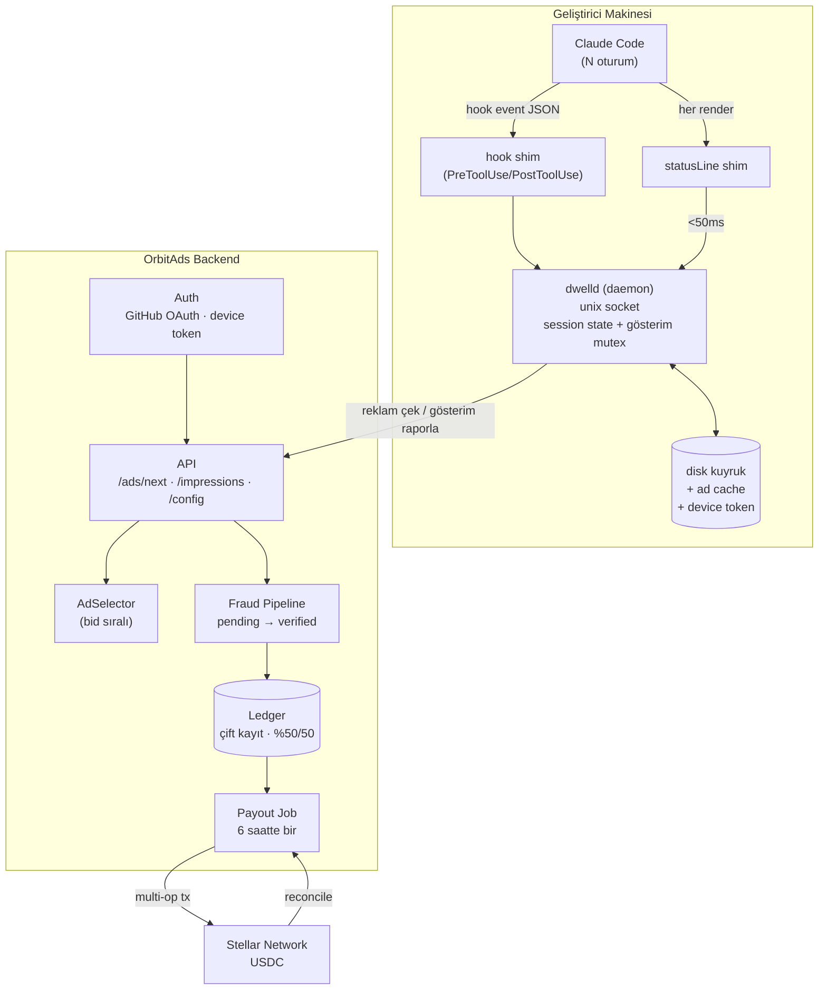
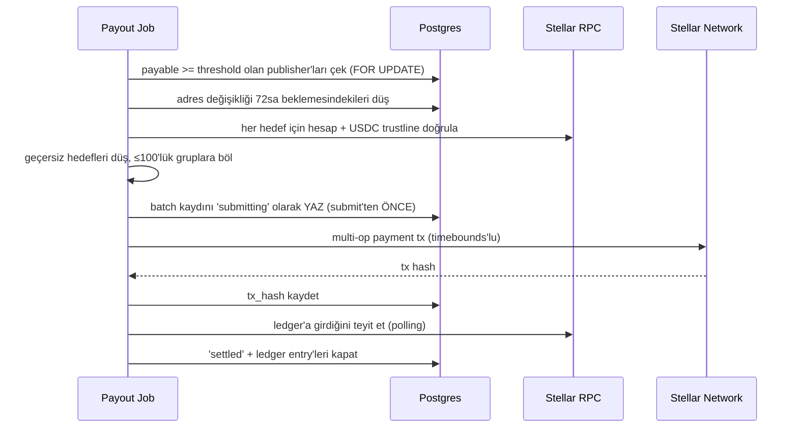

# Dwell

> AI kodlama araçlarının bekleme anlarını, Stellar üzerinden otomatik ödenen bir reklam yüzeyine çeviren terminal-native pazaryeri.

**Durum:** Tasarım aşaması — kod yazılmadı.
**Son güncelleme:** 2026-08-12
**Öncelik:** Omurga. `npx dwell init` → satır görünür → gösterim sayılır → sunucuya gider → ödeme job'ı çalışır → USDC cüzdana düşer. Bu zincir uçtan uca çalışana kadar tier, tavan, fraud kuralları ve reklamveren arayüzü **beklemede** (bkz. §12.0).

> **Not:** Ürün adı `OrbitAds`'ten `Dwell`'e alındı (Instawards SOW ile hizalı). CLI komutu `dwell`, daemon `dwelld`, yerel dizin `~/.dwell/`, npm paketi `dwell`.

---

## 1. Tek Cümlelik Tanım

Geliştirici terminalinde, AI kodlama aracı (öncelik: Claude Code) bir işlem beklerken kısa bir sponsorlu satır gösterilir; doğrulanan her gösterim geliştiricinin bakiyesine yazılır ve Stellar ağı üzerinden USDC olarak toplu şekilde otomatik ödenir.

**Farklılaştırıcı:** Referans alınan modeller (ör. kickbacks.ai) ödemeleri haftalar süren manuel banka batch'leriyle yapıyor. OrbitAds, ödemeyi zincir üstüne alarak banka hesabı gerektirmeyen, küresel, 24-48 saat içinde tamamlanan otomatik bir akışa çeviriyor.

---

## 2. Terminoloji

| Terim | Anlam |
|---|---|
| **Impression (gösterim)** | Sponsorlu satırın, bir bekleme turu içinde kesintisiz ≥10 saniye kaldığı tek bir olay. Uzun turlarda rotasyonla birden fazla gösterim üretilir (ADR-022) |
| **Tur (turn)** | Kullanıcının prompt'u gönderdiği andan cevabın tamamlandığı ana kadar geçen süre. `prompt_id` ile ayırt edilir; `UserPromptSubmit` ile başlar, `Stop` ile biter |
| **Wait window** | = Tur. Kullanıcı açısından tek ve kesintisiz bir beklemedir. İçindeki tool çağrıları (medyan 0.2 sn) beklemeyi **bölmez** — reklam satırı boyunca ekranda kalır |
| **Session** | Tek bir Claude Code oturumu; `session_id` ile ayırt edilir |
| **Publisher** | Reklamı gösteren geliştirici (arz tarafı) |
| **Advertiser** | Kampanya oluşturup teklif veren reklamveren (talep tarafı) |
| **Rate snapshot** | Gösterim anında dondurulan birim fiyat (`rate_micros`); sonradan değişmez |
| **Accrual** | Doğrulanmış gösterimin publisher ledger'ına yazılan alacak kaydı |
| **Payable** | 24 saatlik pending süresini ve doğrulamayı geçmiş, ödemeye hazır bakiye |
| **Batch** | Tek Stellar transaction'ında ≤100 publisher'a yapılan toplu ödeme |
| **Daemon** | Kullanıcı makinesinde çalışan uzun ömürlü yerel süreç (`dwelld`) |
| **Shim** | Claude Code'un çağırdığı, daemon'a bağlanan kısa ömürlü script |
| **Device token** | Cihaz başına üretilen, iptal edilebilir API kimlik bilgisi |
| **Trust tier** | Hesabın güven segmenti; tavanı ve pending süresini belirler |

---

## 3. Kapsam

### MVP'de VAR
- Claude Code entegrasyonu: `npx dwell init` → `~/.claude/settings.json`'a hooks + `statusLine` yazılır; o makinedeki tüm oturumlarda reklam döner
- Sponsorlu satır render + ≥10sn gösterim ölçümü + görsel ifşa (`✶`)
- Spinner katmanı (`spinnerVerbs`) — görünürlük eklentisi; ölçüm ve faturalama buna dayanmaz (ADR-001)
- GitHub OAuth ile hesap + cihaz başına iptal edilebilir token
- Gösterim raporlama, pending → doğrulama → payable akışı
- Fraud katmanı (hesap açma maliyeti, günlük tavan, datacenter IP, makine başına tek gösterim, temel anomali kuralları)
- Çift kayıtlı ledger + %50/50 gelir paylaşımı + rate snapshot
- Stellar testnet üzerinde batch ödeme (multi-operation payment)
- İmzayla doğrulanmış cüzdan bağlama
- `dwell` CLI: `init`, `login`, `wallet`, `balance`, `status`, `doctor`, `pause`, `privacy`, `uninstall`

### MVP'de YOK (bilinçli olarak ertelendi)
- Gerçek açık artırma motoru → `priority` + bid sıralaması yeterli
- Web dashboard (reklamveren + publisher paneli)
- VS Code / JetBrains eklentileri
- Codex, Gemini CLI, Cursor CLI adapter'ları
- Reklamveren self-servis onboarding + ödeme alma (kampanyalar elle girilir)
- Mainnet ödeme
- Tıklama/dönüşüm attribution

### Hiç yapılmayacak
- Ham stdout parse ederek başka bir uygulamanın TUI'sine enjeksiyon (bkz. ADR-001)
- Kod, prompt, transcript veya dosya yolu içeriğinin sunucuya gönderilmesi (bkz. ADR-013)

---

## 4. Mimari Kararlar (ADR)

Bu bölüm dokümanın çekirdeğidir. Her karar bir alternatifi reddediyor; gerekçeyi kaybetmemek için burada duruyor.

> **Sıralama notu:** ADR'ler numara sırasında değil, **konu sırasında** duruyor. ADR-020 (hedef adres politikası) ve ADR-021 (reklamveren yatırma) sonradan eklendi ama genişlettikleri kararın — ADR-014'ün — hemen ardına konuldu; ayrı okunmaları anlamsız olurdu.

### ADR-001 — Render yüzeyi: PTY wrapper değil, Claude Code'un resmî uzantı noktaları

> ### ⚠️ Bekleme penceresinin tanımı — Kıvılcım 1 düzeltmesi (2026-08-13)
>
> Bu ADR'nin ilk hâli bekleme penceresini `PreToolUse → PostToolUse` farkı olarak tanımlıyordu. **Bu yanlıştı ve ölçümle kanıtlandı:** o fark tool çalışma süresidir ve tool'ların %96.3'ü **1 saniyenin altında** biter (Read, Grep, Edit hızlıdır). O tanımla ≥10sn envanter **sıfır** çıkıyor.
>
> Kullanıcının ekranda `Germinating… (1m 32s)` görürken beklediği şey tool değil, **modeldir.** Model beklemesi hook'ların **arasındaki boşluktadır:**
>
> ```
> PostToolUse[i]   →  PreToolUse[i+1]    model sonraki adımı düşünüyor
> PostToolUse[son] →  Stop               model nihai cevabı yazıyor
> SessionStart     →  ilk PreToolUse     ilk düşünme
> ```
>
> Bu tanımla model beklemelerinin **%40.7'si ≥10 saniye** çıkıyor (p50 7.7sn, p90 51sn). Bu ayrım kaçırılsaydı proje "envanter yok" diye kapatılabilirdi.
>
> **Ama doğru birim boşluk da değil — TUR.** Kullanıcı açısından prompt'u gönderdiği andan cevabın geldiği ana kadar geçen süre **tek ve kesintisiz bir beklemedir.** Aradaki 0.2 saniyelik tool çağrıları hiçbir şeyi bölmez; reklam satırı zaten kesintisiz ekranda kalır. Beklemeyi parçalara ayırmak ölçüm kolaylığıydı, kullanıcı gerçekliği değil.
>
> Aynı veriden `prompt_id` ile turlar çıkarıldığında fark büyük:
>
> | | Boşluk bazlı | **Tur bazlı** |
> |---|---|---|
> | p50 | 7.7 sn | **37.3 sn** |
> | p90 | 51 sn | **322 sn** |
> | max | 113 sn | **853 sn** |
> | Gösterim (20sn rotasyon) | 35 | **81** |
>
> **Karar:** `ImpressionSource` **tur** üretir. Tur `UserPromptSubmit` ile açılır, `Stop` ile kapanır, `prompt_id` ile izlenir.
>
> **Bunun bir sonucu:** `UserPromptSubmit` hook'u zorunlu hâle geldi. Kıvılcım 1'de kurulu değildi, bu yüzden turun başındaki ilk düşünme süresi ölçülemedi — yukarıdaki tur rakamları **alt sınırdır**, gerçek turlar daha uzun.

**Karar:** Reklam, Claude Code'un **resmî ayar noktaları** üzerinden gösterilir. Kurulum `npx dwell init` ile `~/.claude/settings.json`'a yazar; o andan itibaren o makinedeki her Claude Code oturumunda reklam döner. Ham çıktıya, ekran çizimine veya uygulamanın koduna **hiçbir şekilde dokunulmaz.**

Üç resmî yüzey vardır ve **rolleri farklıdır** — biri diğerinin yerine geçmez:

| Yüzey | Ayar | Rol | Ölçülebilir mi? |
|---|---|---|---|
| **statusLine** | `statusLine` | **Servis + ölçüm motoru.** Omurga budur. | ✅ Evet |
| **Spinner verb'ü** | `spinnerVerbs` | **Görünürlük katmanı.** Gözün baktığı yer. | ❌ Hayır |
| Spinner ipucu satırı | `spinnerTipsOverride` | Opsiyonel ek görünürlük | ❌ Hayır |

Tur tespiti Claude Code hook'ları ile yapılır: **`UserPromptSubmit` turu açar, `Stop` kapatır**; `PreToolUse` / `PostToolUse` / `Notification` tur içi durumu izler. `UserPromptSubmit`'in zorunluluğu Kıvılcım 1'de anlaşıldı — onsuz turun başındaki ilk düşünme süresi ölçülemiyor.

**Ayarların doğrulanmış şekli** (Claude Code v2.1.160 binary'sindeki zod şemasından okundu — bu ayarlar resmî dokümantasyonda yer almıyor, ama şemada `describe()` metniyle birlikte tanımlılar):

```jsonc
// spinnerVerbs — "Customize spinner verbs.
//   mode: 'append' adds verbs to defaults, 'replace' uses only your verbs."
{ "mode": "append" | "replace", "verbs": ["..."] }

// spinnerTipsOverride — "Override spinner tips.
//   excludeDefault: if true, only show custom tips (default: false)."
{ "tips": ["..."], "excludeDefault": false }
```

Uygulamanın mantığı: `spinnerVerbs` yoksa varsayılan liste; `mode: "replace"` ise (liste boş değilse) yalnızca senin verb'lerin; `mode: "append"` ise `[...varsayılanlar, ...seninkiler]`. Varsayılan liste 100+ kelimedir (`Accomplishing`, `Baking`, `Brewing`, `Clauding`, `Cogitating`…).

**Kritik ayrım — görünürlük ile ölçülebilirlik aynı şey değil:**

- `spinnerVerbs` **statik bir listedir.** Claude Code onu `settings.json`'dan okuyup rastgele seçer. Bize **hiçbir geri bildirim gelmez**: hangi kelime ne zaman, kaç saniye gösterildi bilinemez. Reklamı değiştirmek `settings.json`'ı yeniden yazmayı gerektirir.
- `statusLine` **bir komuttur.** Her tetiklendiğinde bizim shim'imiz çalışır. Gösterildiğini biliriz, süreyi sayabiliriz, her seferinde taze reklam servis edebiliriz.

**Dolayısıyla 10 saniye kuralı, gösterim sayımı ve reklam seçimi tamamen `statusLine`'a dayanır.** `spinnerVerbs` yalnızca görünürlük eklentisidir. Faturalama asla spinner'a dayandırılmaz.

**Spinner'ın ölçülmüş sınırı (2026-08-14, temiz koşulda):** Claude Code `spinnerVerbs`'ü **tur başında** okur. Tur içinde dosyayı değiştirmek o turu etkilemez; değer bir sonraki prompt'ta geçer.

Yöntem: rakip ürün aynı alanı 7-37 saniyede bir yazarken ekran izlendi. Dosya sürekli değişti, spinner tur boyunca sabit kaldı, sonraki prompt'ta değişti. **Aynı sınır rakipte de var** — saniyede bir yazmalarına rağmen tur içinde döndüremiyorlar.

| | statusLine | spinnerVerbs |
|---|---|---|
| Tur **içinde** rotasyon | ✅ 20 saniyede bir | ❌ imkânsız |
| Tur **başına** farklı reklam | ✅ | ✅ |
| Gösterim sayılır | ✅ | ❌ |

Bunun kod karşılığı: sıradaki reklam **tur biter bitmez** yazılır. Tur içinde güncellemek işe yaramaz — dosyada biten turun reklamı kalır ve bir sonraki tur onu yakalar, yani sürekli bir tur geriden gelinir.

Liste **asla boşaltılmaz**: boş liste Claude Code'u kendi varsayılan kelimelerine düşürür (`mode: "replace"` ama liste boşsa varsayılanlar).

> **Bir önceki ölçüm ("oturum başında sabitliyor") yanlıştı** ve nedeni öğretici: o sırada makinede rakip bir ürün de aynı alana yazıyordu. **Aynı yüzeye yazan başka bir yazılım varken yapılan ölçüm geçersizdir.** Tek yazar kalmadan tekrar edilmeli.

**`mode` seçimi bir ürün kararıdır, Kıvılcım 1'de test edilir.** `append` reklamı 100+ varsayılan kelimeyle karıştırır — ne zaman görüneceği belirsizleşir ve reklamverene ne satıldığı bulanıklaşır. `replace` Claude Code'un kişiliğini tamamen siler; kullanıcının buna tepkisi bilinmiyor.

**İfşa (ADR-013 ile bağlantılı):** Spinner verb'ü olarak konan marka adı, kullanıcıya Claude Code'un kendi çıktısı gibi görünür — bu, ADR-013'ün "reklam organik araç çıktısı gibi biçimlendirilmez" kuralının doğrudan ihlalidir. Bu yüzden **spinner verb'ü de `✶` glifiyle başlar**: `✶ Firecrawl…`. İstisna yoktur.

**Reddedilen alternatifler:**

| Alternatif | Neden reddedildi |
|---|---|
| PTY wrapper (`dwell run claude`), stdout'a satır enjeksiyonu | Claude Code full-screen bir TUI; ekranı cursor adresleme ve bölgesel redraw ile çiziyor. Ham byte akışına satır enjekte etmek uygulamanın ekran modeliyle gerçek terminali ayrıştırır → görsel bozulma. Doğru yapmak için headless terminal emülatörü (`@xterm/headless`) + kompozitleme + SIGWINCH/alternate screen/bracketed paste proxy'lemesi gerekir; pratikte mini bir tmux yazmak demek. Ayrıca her Claude Code sürümünde kırılır. |
| tmux `status-right` + `capture-pane` polling | Bozulma riski yok ama kullanıcıya tmux şartı koşuyor, kitleyi daraltıyor. Sonraki bir adapter olabilir. |
| Terminal emulator eklentisi (iTerm2, WezTerm) | Platform başına ayrı iş, dağıtım maliyeti yüksek. |
| Yalnızca `spinnerVerbs` kullanmak (statusLine olmadan) | En görünür yüzey, ama **ölçüm imkânsız** ve tur içinde rotasyon yok: gösterildiğine dair sinyal gelmez, süre bilinmez, reklam dinamik değişemez. Faturalanabilir bir envanter kurulamaz. Görünürlük katmanı olarak kalır, omurga olamaz. |
| Claude Code'un çizim koduna yama (referans üründe gözlenen yaklaşım) | Her sürümde kırılır ve kullanıcının kurulu yazılımını değiştirir. Resmî ayarlar aynı sonucu verirken bu riski almanın gerekçesi yok. **"Claude Code'u yamalamıyoruz, desteklenen uzantı noktalarını kullanıyoruz" bir satış argümanıdır** — güvenlik hassasiyeti yüksek bir kitleye satıyoruz. |

**Bu kararın üç problemi aynı anda çözmesi:**
1. **Tespit** heuristik regex değil, olay tabanlı ve kesin hale gelir
2. **Render** tahribatsız ve desteklenen bir yolla yapılır
3. Hook'lar yalnızca gerçek bir Claude Code oturumundan tetiklendiği için, v2'ye ertelenen **"usage-verified impressions"** katmanının temeli MVP'de bedavaya gelir

**`statusLine`'ın doğrulanmış mekaniği** (resmî dokümantasyondan — açık soru #1 ve #2'nin bir kısmını kod yazmadan kapatıyor):

| Konu | Gerçek | Bizim için anlamı |
|---|---|---|
| **Nereye basılıyor** | Footer rozetlerinin **üstünde kendi satırına**; footer'ın yerini almıyor | Kullanıcıdan bir satır yer alıyoruz, mevcut bilgisini silmiyoruz |
| **Yan etki** | Custom statusLine tanımlıyken Claude Code footer klavye ipuçlarının çoğunu gizliyor (`esc to interrupt`, `? for shortcuts`) | Kullanıcıdan bir şey **alıyoruz**. `dwell uninstall` bunu geri getirmek zorunda; `dwell init` kurulumda bu etkiyi açıkça söylemeli |
| **Ne zaman çalışıyor** | Oturum başında; yeni asistan mesajı geldiğinde; `/compact` bitince; izin modu değişince; vim modu değişince | **Bekleme sırasında tetiklenmiyor** — satır donuk kalırdı |
| **`refreshInterval`** | Komutu N saniyede bir yeniden çalıştırır, **minimum 1** | ⭐ Açık soru #1'in cevabı. Bunu ayarlayarak satır bekleme sırasında da canlı kalır ve **süre ölçümü mümkün olur** |
| **Debounce** | 300 ms; script çalışırken yeni tetik gelirse çalışan script iptal edilir | Shim'in <50 ms bütçesi (ADR-003) bu yüzden kritik |
| **Girdi** | JSON stdin ile gelir: `model.*`, `cwd`, `workspace.*` ve diğerleri | `session_id` ve `cwd` buradan; `cwd` ham gönderilmez (ADR-013) |
| **Renk** | ANSI escape kodları destekleniyor | ✅ `✶` glifi ve marka vurgusu renklendirilebilir (allowlist ile — ADR-007) |
| **Tıklanabilirlik** | OSC 8 hyperlink destekleniyor (iTerm2, Kitty, WezTerm) | ⭐ §15.3'teki "attribution yok" zayıflığı kısmen çözülebilir — tıklama ölçülebilir hale gelir |
| **Genişlik** | `tput cols` **çalışmaz** (çıktı yakalanıyor); `COLUMNS` env değişkeni okunur (v2.1.153+) | Reklam metni terminal genişliğine göre kırpılır |
| **Çok satır** | Her `echo` ayrı satır olur | MVP'de tek satır — ifşa ve yer kaplama dengesi |
| **Maliyet** | Yerel çalışır, API token tüketmez | Kullanıcıya maliyeti yok, bu söylenebilir |
| **Gizlenme** | Autocomplete, yardım menüsü ve izin istemleri sırasında geçici olarak gizleniyor | Gösterim sayacı bu boşlukları "gösterim" saymamalı |

**Bu kararın çözdükleri:**
1. **Tespit** heuristik regex değil, olay tabanlı ve kesin hale gelir
2. **Render** tahribatsız ve desteklenen bir yolla yapılır — kullanıcının kurulu yazılımına dokunulmaz
3. Hook'lar yalnızca gerçek bir Claude Code oturumundan tetiklendiği için, v2'ye ertelenen **"usage-verified impressions"** katmanının temeli MVP'de bedavaya gelir
4. `refreshInterval` sayesinde bekleme süresi ölçülebilir — mimarinin en büyük belirsizliği kapanır

**Risk:** Bu karar tek bir araca (Claude Code) bağlar ve o aracın uzantı API'sine bağımlıdır. Dahası, `spinnerVerbs` ve `spinnerTipsOverride` **resmî dokümantasyonda yer almıyor** — yalnızca binary'deki şemada tanımlılar. Belgelenmemiş bir ayar habersiz değişebilir veya kaldırılabilir. Bu yüzden omurga belgelenmiş `statusLine` üzerine kurulur; spinner katmanı kaybedilebilir bir eklenti olarak tasarlanır ve yokluğunda ürün çalışmaya devam eder. ADR-002 aracı değiştirme riskini ayrıca hafifletiyor.

**Doğrulama borcu:** Kıvılcım 1 bu varsayımları kod yazmadan önce ölçecek (bkz. §12.1).

### ADR-002 — Adapter interface: kaynak ve yüzey soyutlanır

**Karar:** İki arayüz tanımlanır ve tüm çekirdek mantık bunların arkasında yazılır:

```ts
interface ImpressionSource {         // bekleme penceresi sinyali üretir
  on(event: 'wait:start' | 'wait:end', cb: (ctx: WaitContext) => void): void
}

interface RenderSurface {            // sponsorlu satırı ekrana koyar
  render(line: SanitizedAdLine | null): void
  readonly capabilities: {
    animated: boolean
    maxWidth: number
    measurable: boolean            // gösterildiğine dair sinyal üretiyor mu?
    dynamic: boolean               // reklam anlık değişebiliyor mu?
  }
}
```

MVP implementasyonları: `ClaudeCodeHookSource` + `StatusLineSurface` (`measurable: true`, `dynamic: true`) + `SpinnerVerbSurface` (`measurable: false`, `dynamic: false`).
Gelecek: `SpinnerTipSurface`, `TmuxStatusSurface`, `CodexSource`.

**`measurable` ve `dynamic` bayrakları neden interface'te:** ADR-001'deki ayrımı tip sisteminde zorunlu kılıyorlar. Faturalama yalnızca `measurable: true` olan yüzeylerden gelen gösterimleri sayar; `measurable: false` bir yüzeyden gösterim raporlamak derlenmemelidir. Aynı şekilde reklam rotasyonu yalnızca `dynamic: true` yüzeylerde anlıktır. Bu iki bayrak olmadan, spinner katmanı eklendiği gün birisi "orada da reklam görünüyor, sayalım" der ve reklamvereni ölçülemeyen bir envanterle faturalandırırız.

**Gerekçe:** ADR-001'in tek-araç riskini mimariye maliyet çıkarmadan izole eder. Adapter değişince ledger, fraud, ödeme katmanlarına dokunulmaz.

### ADR-003 — Yerel daemon zorunlu; render asla network'e bloklanmaz

**Karar:** Kullanıcı makinesinde unix domain socket dinleyen uzun ömürlü bir `dwelld` süreci çalışır. `statusLine` shim'i her render'da bu socket'e bağlanır ve **önceden cache'lenmiş** reklamı alır.

**Gerekçe:** `statusLine` komutu her ekran güncellemesinde çalışır ve milisaniyelerde dönmek zorundadır. İçine network isteği koymak kullanıcının Claude Code deneyimini yavaşlatır — bu, tek seferde uninstall edilme sebebidir.

**Ölçüm (2026-08-13, gerçek shim + gerçek socket):**

| Shim biçimi | boş makine p50 | yüklü makine p50 | 50 ms'i aşan |
|---|---|---|---|
| TypeScript kaynak (`--experimental-strip-types`) | 40 ms | **48 ms** | %25 |
| Derlenmiş düz `.mjs` | **22 ms** | **27 ms** | %5 |

Bunun ~15 ms'i Node'un kendi başlangıcı; socket gidiş-dönüşü yalnızca ~5-7 ms.

**Karar 1 — shim derlenmiş gider.** Çalışma anında tip sıyırmak maliyeti ikiye katlıyor.

**Karar 2 — bütçe 50 ms değil, 200 ms.** İlk 50 ms değeri ölçülerek değil akıl yürütülerek konmuştu ve iki noktada yanlıştı:

1. **Aşmanın bedeli sanıldığından büyük.** Shim boş dönünce statusLine o yenilemede **kayboluyor** — ölçülemeyen bir gösterim değil, kullanıcının gördüğü titreme.
2. **Düşük bütçeyi savunan gerekçe hatalı.** Claude Code zaten 300 ms debounce uyguluyor ve yeni tetik gelirse çalışan script'i **iptal ediyor**; yavaş bir script arayüzü bloklamıyor, yalnızca o yenilemeyi geciktiriyor.

200 ms'te yüklü makinede bile aşım **0/20**. Daemon takılırsa saniyede bir 200 ms'lik gecikme kabul edilebilir sınırlarda.

**Bu bulgu yüklü makinede ortaya çıktı ve önemi buradan geliyor:** geliştirici build veya test koştururken makine yüklü olur — yani beklemelerin en uzun, reklamın en değerli olduğu an. Envanteri tam orada kaybediyorduk.

Günlük maliyet: 13.733 çağrı × 22 ms ≈ **5 dakika CPU/gün**. Kabul edilebilir ama ihmal edilebilir değil — ileride sıkışırsak derlenmiş binary (~2-5 ms) seçeneği duruyor.

Shim `@dwell/protocol` **import etmez**; zod'u her tıkta yüklemek israf olur. Yalnızca `node:net`. Bütün iş daemon'da.

**Reddedilen alternatif — dosyadan okumak.** Shim, daemon'a bağlanmak yerine önceden yazılmış bir dosyayı okuyabilirdi (referans üründe gözlenen yaklaşım: `~/.vibe-ads/cli-ad.json`). Reddedildi:

| | Dosya | Socket |
|---|---|---|
| Gecikme | ~22 ms | 27 ms |
| Daemon'a "gösterildi" sinyali | **yok** | var |
| Daemon ölüyken | eski reklam görünür | hiçbir şey görünmez |

**Belirleyici olan gecikme değil, ölçüm.** Faturalandırmanın tamamı "shim çalıştıysa satır basılmıştır" kuralına dayanıyor; dosya okuma tek yönlüdür ve daemon'a hiçbir sinyal göndermez. Gösterimi sayamazsan fatura kesemezsin.

Daemon ölüyken eski reklamı göstermek de kazanç değil kayıptır: gösterim sayılmadığı için publisher kazanmaz, reklamveren faturalanmaz, geriye yalnızca kullanıcıyı bedava rahatsız etmek kalır.

**Gecikme ileride de bu kararı değiştirmez:** 27 ms'in ~15 ms'i Node'un başlangıcı. Dosyaya geçmek o maliyeti kaldırmaz, yani dosya hiçbir zaman 20 ms'in altına inemez. Gerçekten daha hızlısı gerekirse çözüm dosya değil, derlenmiş binary (~3 ms) olur.

**Çıktı `writeSync(1, ...)` ile basılır, `process.stdout.write` ile DEĞİL.** statusLine çıktısı her zaman bir pipe'a gider ve pipe üzerinde `process.stdout.write` asenkrondur; hemen ardından gelen `process.exit()` bekleyen chunk'ları düşürür. Kısa satırlar pipe buffer'ına sığdığı için pratikte çalışır, uzun satırda (geniş terminal + uzun URL) **yük altında rastgele** kaybolur — ayıklanması en zor hata sınıfı.

**Terminal yeteneği shim'de tespit edilir, karar daemon'da verilir.** Terminalin kimliği yalnızca shim'in env'inde vardır; shim terminalin içinde çalışır, daemon çalışmaz. Bu yüzden shim pasif bir env parmak izi çıkarıp tick payload'ına `shape` (`osc8` / `plain` / `hybrid`) koyar, satırı yine daemon kurar. Sıralama kritiktir: **TMUX her şeyin önünde** (`allow-passthrough` olmadan OSC 8'i yutar), **SSH ikinci** (env uzakta, tıklayan terminal yerelde), `WT_SESSION` en sonda (sızıntıya açık).

> **Aktif TTY sorgusu yasak.** Terminal yeteneğini `XTVERSION` / `DA` gibi escape sorgularıyla öğrenmek cazip ama yapılamaz: cevap TTY'nin input stream'ine düşer ve orayı Claude Code'un TUI'si okur — kullanıcının terminaline çöp enjekte edilir. Yalnızca pasif env okuması.

**Katı kurallar:**
- Shim'in bütçesi **< 200ms** (ölçümle belirlendi, yukarı bkz.). Aşarsa boş döner.
- Daemon'a bağlanamazsa shim **hiçbir şey basmaz** (hata mesajı da basmaz).
- Reklam sunucusu erişilemezse cache'ten servis edilir; cache boşsa satır gösterilmez.
- Gösterim olayları diskte kuyruklanır, periyodik olarak toplu gönderilir (offline dayanıklılık).

### ADR-004 — Ölçüm istemci-raporludur; bu kabul edilir ve fiyatlanır

**Karar:** Gösterim doğrulaması kriptografik değil, istatistiksel olacak. Sunucu "12 saniye gösterildi" iddiasını doğrulayamaz — istemci kullanıcının makinesinde çalışır ve değiştirilebilir.

**Yapılacaklar (fraud'u sıfırlamak değil, maliyetini yükseltmek için):**
- Her reklam teslimatında sunucu bir **nonce** üretir; gösterim raporu nonce'u geri getirmek zorundadır (replay'i keser)
- Gösterim ingest'i **istemci üretimi ULID** ile idempotent (retry çift kredi vermez)
- Hook türevi kanıt saklanır: `session_id`, tool-call zamanlama imzası, oturum süresi. Gerçek bir oturumun kaotik ritmi vardır; sentetik trafik düzenli olur.

**Yapılmayacak:** Obfuscation ile güvenlik satın almaya çalışmak. Genel amaçlı makinede istemci attestation'ı mümkün değildir.

### ADR-005 — Para: çift kayıtlı ledger, integer mikro-birim

**Karar:** `users.balance` gibi bir kolon **yok**. Tüm para hareketi append-only `ledger_entries` tablosunda; bakiye = ilgili hesabın entry toplamı.

**Gerekçe:** Fraud clawback'i, reklamveren iadesi, başarısız ödemenin geri alımı — hepsi ters kayıt gerektirir. Mutable balance kolonu ilk clawback'te tutarsızlaşır ve geriye dönük denetlenemez.

**Kurallar:**
- Tutarlar `bigint`, birim **1e-7 USDC** (Stellar'ın klasik varlık hassasiyeti — `int64` stroop, tavanı ≈ 922 milyar USDC). Float **yasak**.
- **İsimlendirme kuralı:** Kolon ve alan adları `*_stroops` (veya `*_e7`) olur, **asla `*_micros` değil.** "Micro" 1e-6 demektir; birim 1e-7'dir. İki ad arasındaki uyuşmazlık kurulu bir **10× ödeme hatasıdır** — biri altı ay sonra `micros`'u 1e-6 varsayar ve on kat az ya da çok öder. `protocol` paketinde tek bir `SCALE = 10_000_000n` sabiti ve branded bir `type Stroops = bigint` tanımlanır; çıplak `bigint` dolaştırmak derlenmez. Bu rename kod yazılmadan bedavadır, sonra mali kayıt üzerinde migration demektir.
- **Ters kayıt asla yeniden hesaplanmaz.** Clawback veya başarısız ödemenin geri alımı, orijinal entry'lerin **negatiflenerek kopyalanmasıyla** yazılır (`amount = -original.amount`, aynı `ref_id`, farklı `idempotency_key`). Formülü negatif girdiyle yeniden çalıştırmak yasaktır: BigInt bölme sıfıra doğru truncate ettiği için yuvarlama artığı ters yöne düşer ve `ref_id` toplamı sıfır olmaz — yani kendi invariant'ını kırar. Bu mantık tek bir `reverse(refId)` fonksiyonuna hapsedilir.
- **`asset` kolonu** NOT NULL olarak baştan bulunur ve invariant `(ref_id, asset)` bazında çalışır. Tek varlık olsa bile: `asset`'siz bir mali tablo, ikinci varlık geldiği gün mali kayıt üzerinde migration demektir.
- Her entry'nin bir `ref` (kaynak olay) ve `type`'ı olur.
- Ledger'a yazan her yol idempotency key taşır.
- **Invariant:** Aynı `ref_id`'ye ait entry'lerin toplamı her zaman sıfırdır. Bu bir testle korunur ve ihlali bug'dır.

### ADR-006 — Ödeme: eşik + periyodik mini batch (≤10 operation)

**Karar:** Gösterim başına on-chain işlem yapılmaz. Kazanç off-chain birikir; eşiği geçen publisher'lar periyodik bir job'da **5-10 operation'lık** Stellar transaction'larıyla ödenir. Protokol sınırı 100'dür ve kod bunu üst sınır olarak doğrular, ama üretimde kullanılan değer konfigürasyondan gelir ve varsayılanı 10'dur.

**Batch boyutunun gerekçesi — önceki sürümdeki hatalı gerekçenin düzeltmesi:**

Stellar'da işlem ücreti `base_fee × operation_sayısı` şeklinde hesaplanır. Yani **100 kişiye tek transaction ile 100 ayrı transaction'ın toplam ücreti birebir aynıdır.** Batch'lemek ücret kazandırmaz. Bu, EVM zincirlerinden miras kalan yanlış bir sezgidir ve dokümanın önceki sürümünde gerekçe olarak yazılmıştı.

Batch'in gerçek tek faydası daha az submission ve daha az mutabakat noktasıdır. Buna karşılık ödenen bedel ağırdır: **tek bir operation'ın başarısız olması tüm transaction'ı başarısız kılar** (§8 tuzak #1). Yani büyük batch, sıfır kazanç için en pahalı arıza modunu satın alır.

Mikro-ödemeyi ekonomik kılan şey batch değil, Stellar'ın operation başına ücretinin (100 stroop ≈ 0.00001 XLM) zaten yok denecek kadar düşük olmasıdır. **Pazarlama metinlerinde "tek bir işlem ücretine yüzlerce geliştirici" denmeyecek** — doğru ifade "operation başına maliyet mikro-sentin altında, batch de mutabakatı tek noktada topluyor".

**Periyot:** Ödeme job'ı günde bir çalışır ve ödeme döngüsü kapanmış hesapları öder. (Önceki sürümdeki 6 saat, ödeme sıklığı politikası netleşene kadar gereksiz operasyonel gürültü üretiyordu.)

**İleride:** Submit→settle p95 süresi 60 saniyeyi aşarsa veya bir pencerede 200'den fazla transaction gerekirse channel account havuzuna geçilir. MVP'de tek source account + advisory lock yeterlidir.

### ADR-007 — Reklam metni düşman girdisidir

**Karar:** Sunucudan gelen reklam metni, terminale basılmadan önce hem sunucuda hem istemcide sanitize edilir.

**Gerekçe:** Terminale basılan metin üçüncü tarafın (reklamverenin) yazdığı içeriktir. İçine ANSI escape dizisi koyabilen bir reklamveren kullanıcının terminalinin kontrolünü alır — cursor manipülasyonu, OSC 52 ile clipboard'a yazma, bazı terminallerde daha ağırı.

**Kural:** Renk/stil yalnızca **bizim** ürettiğimiz, allowlist'teki kodlarla eklenir. Reklamveren ham stil kodu gönderemez, yalnızca semantik alan (`brand`, `text`, `cta`) gönderir.

**Temizle değil, reddet — fail closed.** İlk tasarım "kontrol karakterlerini strip et ve yayınla" idi. Uygulama sırasında bunun yetersiz olduğu görüldü: ESC silinse bile **yük kalıyor.** `Fire\x1B[31mcrawl` → `Fire[31mcrawl`. Güvenli, ama kullanıcıya çöp gidiyor ve reklamverenin niyeti sessizce yutuluyor.

Doğru politika şu ayrımdır:

| İşlem | Ne yapar | Ne zaman |
|---|---|---|
| `normalize()` | Çift boşluk, NBSP, NFC farkı — **masum** biçim bozukluğu | Her zaman, sessizce |
| `hasUnsafeChars()` | Kontrol karakteri, bidi override, sıfır genişlikli — **saldırı işareti** | Reddetme kararı |

Bir kreatifte ESC bulunması "biraz dağınık girdi" değil, saldırı denemesidir. Sunucu kampanyayı kaydetmez ve reklamvereni işaretler; istemci kirli bir kreatif geldiyse **hiçbir şey basmaz** (`assertClean` fırlatır, çağıran taraf susar). Bu, ADR-003'ün "cache boşsa satır gösterilmez" mantığının aynısıdır.

İstemcinin de kontrol etmesinin sebebi: oraya kirli bir kreatif ulaşması ya sunucu kontrolünün atlandığını ya da taşıma katmanının kurcalandığını gösterir. İkisi de "temizleyip göster" değil, "sus ve alarm üret" durumudur.

**Kapsanan vektörler** (`packages/protocol/test/sanitize.test.ts` — 20 saldırı): OSC 52 panoya yazma (BEL ve ST sonlandırmalı), OSC 8 sahte link, ekran temizleme, cursor taşıma, alternate screen, reset'siz renk sızdırma, 8-bit C1 CSI/OSC, satır sonu ve CR enjeksiyonu, bidi override (trojan source), bidi isolate, sıfır genişlikli gizleme, BOM, DEL, Unicode paragraf ayırıcı, BEL spam, tab hizalama, iç içe ESC.

**Kendi ürettiğimiz stil de sızdırmaz:** açılan her stilin kapandığı testle korunur. Kapanmamış bir stil, reklam satırından sonraki tüm terminal çıktısını boyar — yani "renk sızdırma" saldırısının kendi kodumuzdan çıkan hali.

### ADR-008 — Uzaktan kill switch

**Karar:** Daemon periyodik olarak bir remote config çeker; `render_enabled: false` geldiğinde tüm istemcilerde render anında durur.

**Gerekçe:** Bir Claude Code sürümü render'ı bozarsa, kullanıcıların güncelleme yapmasını bekleyemezsin. Tek kurtuluş yolu budur ve sonradan eklenmesi zordur.

### ADR-009 — Bid queue MVP'de bir kolondur

**Karar:** Gerçek açık artırma motoru yazılmaz. `campaigns.bid_micros_cpm` üzerinden `ORDER BY bid_micros_cpm DESC` ile servis edilir; bütçe tükendiğinde kampanya pasifleşir.

**Fiyat birimi:** Teklif **CPM** (1.000 gösterim) cinsindendir. Gösterim başına oran = `bid_micros_cpm / 1000` (integer bölme, kalan platform lehine atılır).

**Gerekçe:** Talep tarafında 3-5 kampanya varken auction motoru yazmak kod borcudur. Arayüz (`AdSelector`) korunur, içi sonradan doldurulur.

### ADR-010 — Kimlik: hesap açmanın bir maliyeti olmalı

**Karar:** Publisher hesabı **GitHub OAuth** ile açılır. Her cihaz için ayrı, iptal edilebilir bir **device token** üretilir; `~/.dwell/credentials.json` içinde `0600` izinle saklanır. Tüm API çağrıları bu token ile authenticate olur.

**Gerekçe:** Fraud modelinin tamamı "hesap" birimi üzerine kurulu — günlük tavan hesap başına, anomali kuralları hesap başına. Hesap açmak bedava ve anlıksa günlük tavan hiçbir işe yaramaz; botçu 500 hesap açar ve tavanı 500'le çarpar. **Sybil'e karşı birinci savunma hattı, hesap açmanın maliyetidir.**

GitHub seçilmesinin sebebi: hedef kitle zaten sahip (ek sürtünme yok), ama hesap yaşı ve public aktivite ölçülebilir bir güven sinyali verir.

**Kurallar:**
- Bir GitHub hesabı = bir publisher hesabı (tekil kısıt)
- **Trust tier:** hesap yaşı < 30 gün veya public aktivite yok → `low` segment: düşük günlük tavan, uzun pending süresi. Zamanla `standard`'a yükselir.
- Device token cihaz başına üretilir, `dwell status` aktif cihazları listeler, tek tek iptal edilebilir
- Token dosyası asla repo'ya, env dosyasına veya log'a yazılmaz

**Reddedilen alternatifler:**

| Alternatif | Neden reddedildi |
|---|---|
| E-posta + şifre | Sybil maliyeti sıfıra yakın; tek başına hiçbir sürtünme yaratmaz |
| Cüzdan adresiyle giriş | Stellar adresi üretmek bedava ve anlık — sybil maliyeti tam sıfır. Cüzdan ödeme hedefidir, kimlik değil. |

---

> ## ⟳ Bu karar değişti — 2026-08-15
>
> **Yeni karar: kimlik cüzdandır.** `dwell login` SEP-10 ile cüzdanı doğrular; `publisherId` adresin kendisidir. GitHub kaldırıldı.
>
> Yukarıdaki gerekçe silinmedi çünkü bir kısmı hâlâ doğru; ama iki noktada eskidi.
>
> **1. "Cüzdanla giriş yazılacak iş" argümanı düştü.** O karar alındığında cüzdan doğrulaması sıfırdan yazılacak bir işti. SEP-10 artık yazılı ve testli (14 test), adres doğrulaması yazılı (19 test), 72 saatlik değişiklik beklemesi yazılı. GitHub device flow ise hâlâ sıfır. Maliyet karşılaştırması tersine döndü.
>
> **2. "Sybil maliyeti tam sıfır" ifadesi eksikti.** Keypair üretmek bedava, doğru. Ama **ödenebilir** bir adres öyle değil: hesabın zincirde var olması (1 XLM) ve USDC trustline'ı (0.5 XLM) gerekiyor — ve bunu ADR-020 zaten şart koşuyor. Yani ~1.5 XLM. Az, ama sıfır değil.
>
> **Asıl düzeltme daha derinde: sybil'i kimlik yöntemi çözmüyor.**
>
> "Kullanıcı 10 cüzdan bağlasa 10 kat kazanır mı?" sorusunun cevabı **hayır** — ve sebebi cüzdanın pahalı olması değil, **ADR-012**: makine başına aynı anda tek gösterim sayılır. Gösterim sayısı cüzdan sayısına değil, gerçek tur sayısına bağlıdır. Bir makinede günde 100 tur varsa, 10 cüzdan bağlamak 1000 tur yaratmaz; aynı kazancı 10'a böler.
>
> Gerçek saldırı cüzdan çoğaltmak değil **makine çoğaltmaktır**, ve oradaki maliyet VM + Claude Code aboneliği + inandırıcı tur ritmidir (§14).
>
> GitHub da bu tabloyu değiştirmiyordu: §15.6 zaten "yaşlı GitHub hesabı satın alınabilen bir emtiadır, sürtünme yaratır çözmez" diyor. İki yöntem de sürtünme; ikisi de duvar değil.
>
> **Savunma sırası (kimlik yönteminden bağımsız):**
>
> | # | Katman | Durum |
> |---|---|---|
> | 1 | Makine başına tek gösterim (ADR-012) | ✅ yazılı, testli |
> | 2 | Günlük tavan | ✅ yazılı |
> | 3 | İlk ödeme kapısı (§13.1) | ⬜ rakamlar bekliyor |
> | 4 | Aynı IP'den çok hesap | ⬜ **bilerek ertelendi** |
> | 5 | Tur ritmi anomalisi | ✅ yazılı, testli |
>
> **4. madde neden ertelendi:** eşiği gerçek kullanıcı dağılımını görmeden koymak, çalıştığını sandığın ama çalışmayan bir savunma yazmaktır. Aynı IP'yi paylaşan gerçek kullanıcılar var (ofis, üniversite, ev). Ayrıca `projectKey` bu iş için **kullanılamaz**: her makinedeki yerel tuzla türetildiği için, aynı makinede ayrı dizinlerle çalışan iki daemon farklı anahtar üretir. Elde yalnızca IP kalıyor.
>
> **Yeni kararın bedeli — hesap kurtarma yok.** Cüzdanını kaybeden kullanıcı birikmiş bakiyesini de kaybeder. GitHub'da "şifremi unuttum" vardı, cüzdanda yok. Bu kurulumda **açıkça** söylenecek.
>
> **GitHub silinmedi, teşvike dönüştü.** İleride "GitHub bağlayan hesabın tavanı yükselir" şeklinde bir güven sinyali olarak eklenebilir. Zorunlu değil, ödül.

### ADR-011 — Gelir paylaşımı %50/50 ve fiyat gösterim anında dondurulur

**Karar:** Publisher payı **%50** (`rev_share_bps = 5000`, kampanya bazında override edilebilir alan olarak tutulur ama MVP'de sabit). Gösterim kaydedildiği anda geçerli birim fiyat `impressions.rate_micros` olarak satıra **dondurulur** ve bir daha değişmez.

**Gerekçe:** Kampanya bid'i her an değişebilir, bütçesi bitebilir, kampanya durabilir. Fiyat dondurulmazsa dünkü gösterimin bugünkü değeri farklı hesaplanır; ledger ile kampanya bütçesi tutmaz ve geriye dönük denetim imkansızlaşır.

**Gösterim `verified` olduğunda tek transaction'da yazılan kayıtlar:**

```
advertiser  −rate_micros                 (kampanya bütçesinden düşer)
publisher   +rate_micros × 5000 / 10000
platform    +rate_micros − publisher payı  (yuvarlama artığı platformda)
─────────────────────────────────────────
toplam      0                            ← ADR-005 invariant'ı
```

`rejected` gösterimde hiçbir kayıt yazılmaz — reklamveren faturalanmaz (§9).

### ADR-012 — Makine başına aynı anda tek aktif gösterim

**Karar:** Daemon **session başına** bekleme state'i tutar, ancak aynı anda yalnızca **bir** oturum gösterim sayabilir. Gösterim hakkı, makine kapsamında bir mutex'tir. Aktif oturum = en son hook event'i üreten oturum.

**Gerekçe:** İki ayrı sebep, ikisi de tek başına yeterli:

1. **Doğruluk.** Kullanıcının gözü tek bir terminaldedir. 3 paralel oturumu 3 gösterim saymak reklamvereni faturalandırırken yanıltmaktır.
2. **Fraud.** Aksi halde en ucuz saldırı "10 terminal aç, 10× kazan" olur — VM yok, proxy yok, sahte hesap yok, tek makinede tek kullanıcı. Datacenter IP filtresi de günlük tavan da bunu görmez.

**Not:** Gerçek terminal odağı tespiti taşınabilir değil; "en son event üreten oturum" MVP için yeterli yaklaşımdır. Günlük tavan (§9) bu heuristiğin üstünde ikinci sınır olarak durur.

### ADR-013 — Veri minimizasyonu ve açık ifşa

**Karar** — iki bağlayıcı parça:

1. **İfşa:** Sponsorlu satır her zaman `✶` glifi ve marka adıyla başlar. Reklam olduğu hiçbir koşulda gizlenmez, organik çıktı gibi gösterilmez.
2. **Veri minimizasyonu:** Sunucuya yalnızca §10'da isim isim sayılan alanlar gider. Kod, dosya isimleri, prompt/yanıt/transcript içeriği ve **ham `cwd`** asla gönderilmez.

**Gerekçe:** Hedef kitle terminaline üçüncü taraf yazılım kuruyor ve ilk soracağı şey "bu ne gönderiyor" olacak. Tek bir "bu araç proje isimlerimi sunucusuna yolluyormuş" bulgusu ürünü bitirir — teknik olarak haklı olsan bile. Ayrıca reklam ifşası birçok yargı bölgesinde yasal zorunluluktur.

**`cwd` düzeltmesi:** Anomali tespiti için proje ayrımı gerekiyor ama path gerekmiyor. Ham `cwd` yerine yerel bir tuzla türetilmiş `project_key = HMAC(local_salt, cwd)` gönderilir. Tuz cihazda kalır; sunucu projeleri ayırt edebilir, adlarını öğrenemez.

### ADR-014 — Cüzdan bağlama tarayıcıda yapılır; CLI hiçbir zaman secret key görmez

**Karar:** `dwell wallet` bir tarayıcı sayfası açar. Kullanıcı **Freighter veya LOBSTR** ile bağlanır, imzalaması gereken şeyi cüzdanında onaylar, CLI sonucu polling ile bekler. **CLI hiçbir koşulda secret key istemez, kabul etmez, görmez.**

Adres **değişikliğinden** sonra 72 saat boyunca ödeme yapılmaz; bildirim hem e-postaya hem **daemon üzerinden terminale** gider.

**Reddedilen alternatif — "kullanıcı challenge'ı secret key'iyle imzalar":** Dokümanın önceki sürümündeki bu akış iki sebeple çalışmaz.

1. **Kimse yapmaz.** Hedef kitle USDC'yi Freighter/LOBSTR/Ledger'da tutuyor; bu ürünler secret key'i dışa vermez ve makul hiçbir kullanıcı `S...` anahtarını bir terminal aracına yapıştırmaz. Yapıştıran da boş bir keypair üretip yapıştırır — yani doğrulama "bu adresi kontrol ediyorum" değil, "keypair üretebiliyorum" demeye indirgenir.
2. **Signing oracle yaratır.** Challenge byte'larını sunucu seçiyor. Ele geçirilmiş bir sunucu challenge yerine gerçek bir payment transaction'ının hash'ini gönderirse kullanıcı kendi cüzdanını boşaltan bir işlemi kör imzalar.

**Doğrulama protokolü:** SEP-10 Web Authentication. Challenge, `sequence = 0` olan ve ağa **hiçbir zaman submit edilemeyen** bir transaction'dır — güvenlik özelliği yapının kendisinden gelir. SDK'da hazır: `WebAuth.buildChallengeTx` / `readChallengeTx` / `verifyChallengeTxThreshold`. Bedeli: backend'in SEP-1 `stellar.toml` yayınlaması (`WEB_AUTH_ENDPOINT`, `SIGNING_KEY`, `web_auth_domain`) ve bir tarayıcı sayfası.

**Yan fayda — ADR-020'nin bedava gelmesi:** Aynı sayfada trustline imzası da alınır. Bu olmadan ADR-020'deki sponsorluk vaadi teknik olarak tutulamaz.

**Multisig hesaplar:** Master key ağırlığı 0'a çekilmiş hesaplar (LOBSTR 2FA, kurumsal treasury) ham imza doğrulamasını **geçemez** — imzalayan anahtar adresin kendisi değildir. `verifyChallengeTxThreshold()` signer setini ve threshold'u zincirden okuyup bunu çözer; kendi ed25519 doğrulamanı yazma.

**Omurga sırası:** İmza doğrulaması omurganın 4. adımında değil, üstüne gelir. Omurga çalışırken adres elle yapıştırılıp yalnızca **geçerlilik** kontrolünden geçirilebilir (bkz. ADR-020 kontrol listesi). SEP-10 sonra takılır; şema değişmez.

### ADR-020 — Hedef adres politikası: sadece kendi cüzdanı, trustline zorunlu

**Karar:** MVP'de yalnızca kullanıcının kendi kontrolündeki `G...` adresleri kabul edilir. Adres bağlanırken şu kontrollerin **tamamı** geçilmek zorunda:

| # | Kontrol | Geçilmezse çıkan hata |
|---|---|---|
| 1 | Strkey formatı ve checksum geçerli (`StrKey.isValidEd25519PublicKey`) | — |
| 2 | `S...` yapıştırılmışsa **anında abort**; terminale basma, log'lama, hataya koyma | — |
| 3 | Hesap zincirde var ve fonlanmış | `op_no_destination` |
| 4 | USDC trustline var | `op_no_trust` |
| 5 | Trustline **authorized** (ara durum `authorized_to_maintain_liabilities` de reddedilir — listede görünür, ödeme yine patlar) | `op_not_authorized` |
| 6 | Trustline limiti yeterli (`balance + amount > limit` olmamalı) | `op_line_full` |
| 7 | Adres USDC issuer'ının kendisi değil (issuer'a ödeme USDC'yi yakar) | — |
| 8 | Adres memo gerektirmiyor (SEP-29 / `config.memo_required`) | — |
| 9 | Adres başka bir publisher hesabına bağlı değil | — |

**Trustline'sız adres reddedilir**, ama kullanıcı çıkmaza sokulmaz: aynı tarayıcı sayfasında "USDC'yi aktifleştir" butonu sunulur. Rezervi platform sponsorlar, kullanıcının XLM'e ihtiyacı olmaz.

**Kritik teknik gerçek — SOW'daki vaadin düzeltmesi:** `changeTrust` operation'ı **yalnızca hesabın kendisi tarafından imzalanabilir.** Platform rezervi ödeyebilir (`beginSponsoringFutureReserves`), transaction ücretini ödeyebilir, hesabı açabilir — ama trustline'ı kullanıcı adına tek taraflı **açamaz.** Gerçek akış:

```
kullanıcı adresi verir
  → platform hesabı açar + rezervi sponsorlar        (platform imzası)
  → kullanıcı tarayıcıda trustline'ı onaylar          (kullanıcı imzası, XLM gerekmez)
  → USDC alabilir
```

Vaadin özü tutuluyor (XLM'i olmayan biri USDC alabiliyor), ama "sadece adresini versin, gerisini biz hallederiz" ifadesi **yanlıştır ve kullanılmayacaktır.** Bir tık eklenir.

**Reddedilenler ve sebepleri:**

| Adres tipi | Karar | Sebep |
|---|---|---|
| `C...` (smart wallet / passkey) | MVP'de reddet, sebebini yaz | Klasik `payment` destination'ı `G`/`M` olmak zorunda. Contract account'a USDC göndermek SAC `transfer` = `invokeHostFunction` demek ve bir Soroban transaction'ında tek host-function operation'ı bulunur, klasik op'larla karışmaz — batch modelini matematiksel olarak kırar. SEP-10 de imzalayamaz (cevabı SEP-45, hâlâ Draft). |
| `M...` (muxed) | MVP'de reddet, sonra aç | Memo probleminin doğru çözümü ve batch'i bozmaz. Şimdi kapsam dışı, ama `stellar_address` kolonu **en az `varchar(69)`** olacak (muxed adres 69 karakter; 56 varsayarsan sessizce kırılırsın). |
| Borsa yatırma adresi | Reddet (#8) | Memo transaction seviyesindedir, operation seviyesinde değildir. Batch'te hedef başına memo koymak imkânsızdır; memo'suz gönderilen para borsada kaybolur ve geri gelmez. Freighter/LOBSTR zorunluluğu bu riski zaten büyük ölçüde kapatır. |

### ADR-023 — Reklam yalnızca tur içinde görünür; boşta ekran temiz kalır

**Karar:** Reklam **yalnızca aktif bir tur sürerken** gösterilir. Tur bitince, artı **4 saniyelik tolerans** sonunda, tüm yüzeyler susar. Kullanıcı kod okurken, prompt yazarken veya makineden uzaktayken ekranda reklam **yoktur.**

```
kullanıcı bekliyor              kullanıcı boşta
  ✶ Firecrawl…                    (spinner yok)
  › ▊                             › ▊
  ✶ Firecrawl — docs to LLM…      (statusLine boş)
```

**Gerekçe — üç ayrı sebep, üçü de tek başına yeterli:**

1. **Gösterim ile fatura örtüşür.** Zaten yalnızca tur içindeki süreyi sayıyoruz (ADR-022). Saymadığımız bir süre boyunca reklam göstermek, kullanıcıya bedava rahatsızlık vermektir — karşılığında bir kuruş kazanmadan.
2. **Ürünün vaadi bu.** "Beklerken kazan" diyoruz. Beklemediği anda reklam göstermek vaadi bozar; kullanıcı bunu ilk günde fark eder.
3. **Kullanıcıdan aldığımız yeri geri veririz.** Custom `statusLine` tanımlıyken Claude Code footer ipuçlarını gizliyor (`esc to interrupt`). Boşta susan bir satır bu maliyeti aktif olmadığı sürece sıfırlar — satırın tamamen kaybolup kaybolmadığı ölçülecek (aşağıya bakınız).

**4 saniyelik tolerans:** Tur bittiği anda kesmek yanlış. Tur sınırları her zaman net değil ve arka arkaya gelen kısa turlarda reklam yanıp söner — bu, sürekli göstermekten daha rahatsız edicidir. Tolerans bittikten sonra susulur. (Referans üründe de aynı yaklaşım var; süre oradan alındı.)

**Gösterimin sayılması için altı şartın tamamı gerekir:**

| # | Şart |
|---|---|
| 1 | Aktif bir tur sürüyor (veya tolerans içinde) |
| 2 | Geçerli, süresi dolmamış bir reklam var (demo/placeholder değil) |
| 3 | Kullanıcı giriş yapmış ve token geçerli |
| 4 | Remote config render'a izin veriyor (kill switch + yüzey bayrağı) |
| 5 | Kullanıcı yerel olarak duraklatmamış (`dwell pause`) |
| 6 | Yüzey **başarıyla** uygulandı — satır gerçekten basıldı |

Altısından biri eksikse gösterim **sayılmaz.** Şüphede olan gösterim sayılmaz; fail closed.

**Açık teknik soru — daemon'un ilk işi:** `statusLine` script'i boş çıktı verdiğinde satır tamamen kayboluyor mu, yoksa boş bir satır olarak yer kaplayıp footer ipuçlarını gizlemeye devam mı ediyor?

- **Kayboluyorsa:** karar budur, `statusLine` + `spinnerVerbs` ikisi de kalır, ikisi de yalnızca tur içinde çalışır.
- **Kaybolmuyorsa:** boşta bile bir satır ve gizli footer ipuçları demektir. O durumda `statusLine` tamamen bırakılıp yalnızca `spinnerVerbs` kullanılır — bedeli tıklanabilir link (OSC 8), uzun metin ve 2.1.143 öncesi sürüm uyumudur.

### ADR-022 — Uzun turlarda reklam döndürülür

**Karar:** Bir gösterim, reklamın bir tur içinde kesintisiz **≥10 saniye** ekranda kalmasıdır. Tur bundan uzunsa reklam **döndürülür** ve her tam pencere ayrı bir gösterim sayılır. Rotasyon aralığı remote config'ten gelir; başlangıç değeri **20 saniye**.

```
0sn ────────── 20sn ────────── 40sn ────────── 60sn ── tur bitti (71sn)
 ✶ Firecrawl    ✶ Resend        ✶ Neon          ✶ Firecrawl
 gösterim 1     gösterim 2      gösterim 3      (11sn — 10sn'yi geçti, sayılır)
```

**Gerekçe:** Ölçüm, turların p90'ının **322 saniye** olduğunu gösterdi (§12.2). 322 saniye boyunca tek bir reklam göstermek envanterin büyük kısmını çöpe atmaktır. Aynı veride 20 saniyelik rotasyon gösterim sayısını **35'ten 81'e** çıkarıyor — 2.3 kat, ve maliyeti sıfır, çünkü `statusLine` zaten 2.1 saniyede bir yenileniyor (§12.2).

**Kurallar:**
- Rotasyon aralığı ≥ minimum gösterim süresi. Aksi hâlde hiçbir reklam nitelikli süreyi dolduramaz.
- Bir turun **son parçası** 10 saniyeyi geçmediyse sayılmaz — kullanıcı onu doğru dürüst görmedi.
- Aynı reklam bir tur içinde ardışık tekrar etmez; havuz tükenirse rotasyon durur ve son reklam kalır.
- Rotasyon yalnızca `statusLine`'da geçerlidir. `spinnerVerbs` statik bir listedir ve zaten sayılmaz (ADR-001).

**Reddedilen alternatif — süre-ağırlıklı tek gösterim** ("322 saniye = 32 gösterim değeri"): Reklamveren tarafında satılamaz. CPM standardı gösterim sayar, ekran süresi değil; "bir gösterim" tanımını piyasadan ayırmak fiyatlandırmayı ve karşılaştırmayı imkânsızlaştırır.

**Fatura dürüstlüğü:** Yalnızca aktif tur içindeki süre faturalanır. Kullanıcı kod okurken veya prompt yazarken ekrana bakmıyor sayılır — ve ADR-023 gereği o anlarda reklam zaten gösterilmez. Teknik olarak sürekli gösterip hepsini saymak mümkündü; yapılmaması bilinçli bir karardır.

### ADR-024 — Reklamveren tarafı açık; kapı içerik değil, bütünlük kontrolü

**Karar:** Herkes reklam verebilir. Kategori yasağı, sektör filtresi veya editoryal onay **yok**. Reklamveren cüzdanını bağlar, parasını yatırır, kampanyası yayına girer.

**Gerekçe:** Talep tarafı şu an boş ve ürünün en büyük riski bu (§15). Kapıya bekçi koymak, henüz kuyruk yokken kuyruğu yönetmeye çalışmaktır. Politika, gerçek bir reklamveren akışı oluştuğunda ve somut bir sorun görüldüğünde yazılır — önce değil.

**Ama üç teknik kontrol politikadan bağımsız olarak gerekli.** Bunlar içerik yargısı değil, sistemin kendi bütünlüğü:

1. **Kreatif metni düşman girdisidir** (ADR-007). Kontrol karakteri içeren kreatif reddedilir — bu zaten uygulanıyor, 20 saldırı vektörü testli.

2. **Bağlantı, metinde yazan alan adıyla eşleşmek zorunda.** Kreatifte `firecrawl.dev` yazıp `evil.example`'a link vermek engellenir. Reklamveren kampanya başına tek bir alan adı beyan eder; tıklama linki o alan adının dışına çıkamaz. Bu bir içerik kararı değil, **kullanıcıyı yanıltmama** kontrolü — reklamı gören kişi nereye gittiğini bilmeli.

3. **Kampanya anında durdurulabilir olmalı.** `campaigns.status = 'suspended'` şemada var ve `AdSelector` bunu zaten filtreliyor. Bir sorun çıktığında müdahale yolu, sorun çıkmadan önce hazır olmalı.

**Sonradan gerekirse ne eklenir:** Kategori kuralı, manuel onay kuyruğu veya reklamveren doğrulaması. Üçü de `campaigns` tablosuna bir alan ve `AdSelector`'a bir filtre; mimariyi değiştirmez. Bu yüzden bugün yazılmasına gerek yok.

**Açık kayıt (§15):** Terminale reklam basan bir ürün, reklamverenini seçmediğinde ne bastığından da sorumlu olmaya devam eder. Bu, bilinerek alınmış bir risktir; ürün büyüdüğünde yeniden değerlendirilecektir.

### ADR-021 — Reklamveren parayı cüzdanından yatırır; her kuruş defterde görünür

**Karar:** Reklamveren kampanya oluştururken cüzdanını bağlar ve platform adresine USDC gönderir. Yatan para **ledger'a bir kayıt olarak girer**; kampanya bütçesi bu bakiyeden türetilir. Bakiyesi biten kampanya otomatik olarak servis dışı kalır.

```
advertiser      +X          (yatırılan tutar)
external_cash   −X
──────────────────────
toplam           0          ← ADR-005 invariant'ı
```

**Bu kararın düzelttiği hata:** Dokümanın önceki sürümünde reklamveren "platform dışında" ödüyordu (eski açık soru #6). Bunun sonucu, `advertiser` hesabının ledger'da **yalnızca eksi yönünün** bulunmasıydı: ADR-011'deki `−rate`. Bakiye sınırsız negatife gidiyor ve `sum(ref) = 0` invariant'ı bunu **yeşil geçiyordu** — çünkü o invariant dengeyi değil, kaydın simetrisini kontrol ediyor. Pratik sonuç: parası hiç gelmemiş bir kampanya reklam yayınlatabilir, publisher'ların payable'ı gerçek bir yükümlülük olarak birikir ve açığı platform kendi cebinden kapatırdı.

**Kurallar:**
- `AdSelector` sert kontrol yapar: `advertiser_balance − reserved <= 0` ise kampanya servis edilmez.
- `campaigns.budget_micros` **bir kolon değildir**; ledger'dan türetilen bir görünümdür. (Mutable bakiye kolonu ADR-005'in reddettiği kalıptır; aynı hatayı bir masa ötede tekrarlamak olur.)
- Yatırma işlemleri `campaign_topups` tablosunda kendi durum makinesiyle izlenir: `pending → confirmed → credited`.
- Kredi yalnızca zincirde teyit edildikten sonra yazılır — `settled` tanımı §8 tuzak #7 ile aynıdır.

**Omurgada:** Kampanya tek ve sabit yazılıdır, dolayısıyla yatırma akışı da elle yapılır — ama **ledger kaydı yine de yazılır.** Bu iki satırlık iş, yukarıdaki deliği baştan kapatır.

**İleride:** Reklamverenin yatırmayı programatik yapması (x402 / MPP Charge üzerinden agent-native top-up) değerlendirilebilir. Stellar tarafında bu bugün kullanılabilir durumda, ama tek noktalı bir facilitator bağımlılığı getiriyor ve paket ekosistemi genç. Omurga kapsamı dışındadır.

### ADR-015 — Anahtar yönetimi ve sıcak cüzdan sınırı

**Karar:**
- Payout source account'ın secret key'i bir secret manager'dan çalışma anında okunur (geliştirmede `.env` + `.gitignore`, staging/prod'da cloud secret manager). Asla log'lanmaz, asla hata mesajına düşmez.
- **Sıcak cüzdan tavanı:** payout hesabında en fazla 7 günlük tahmini ödeme tutulur; fazlası ayrı bir soğuk hesapta bekler.
- Ödeme yapan hesap ile gelir toplayan hesap **ayrıdır**.

**Gerekçe:** Bu anahtar sistemdeki tek gerçek "para" sırrı — sızarsa tüm bakiye tek işlemde gider ve geri alınamaz. Sıcak cüzdan tavanı sızıntının azami zararını sınırlar; ayrıştırma, gelir birikimini aynı riske maruz bırakmaz.

### ADR-016 — Zorunlu minimum istemci sürümü

**Karar:** Remote config `min_client_version` alanı taşır. İstemci sürümü bunun altındaysa render'ı durdurur ve kullanıcıya güncelleme mesajı gösterir; sunucu da eski sürümlerden gelen gösterimleri reddeder.

**Gerekçe:** Ölçüm veya ödeme protokolünde bir hata bulursan yalnızca hatalı istemcileri devre dışı bırakabilmen gerekir. Kill switch (ADR-008) toptan kapatır — bu seçici kapatır. **Alan sonradan eklenemez:** eski istemciler bilmedikleri alanı okumaz, dolayısıyla ilk sürümde bulunmak zorundadır.

---

## 5. Sistem Mimarisi



---

## 6. Bileşenler

### 6.1 CLI (`dwell`)

| Komut | İş |
|---|---|
| `dwell init` | Uçtan uca kurulum: `login` + settings.json kaydı + daemon kurulumu |
| `dwell login` | GitHub OAuth (device flow), device token alır ve `0600` ile kaydeder |
| `dwell wallet set <G...>` | Challenge imzalayarak adres bağlar; hesap varlığı + USDC trustline kontrolü yapar |
| `dwell balance` | Pending / payable / lifetime kazanç, son ödemeler |
| `dwell status` | Daemon sağlığı, son gösterim, aktif kampanya, kayıtlı cihazlar |
| `dwell pause` / `resume` | Render'ı yerel olarak durdur |
| `dwell privacy` | Sunucuya giden alanların tam listesini terminalde gösterir |
| `dwell doctor` | Kurulum teşhisi: settings.json, daemon, socket, sunucu erişimi, token geçerliliği |
| `dwell uninstall` | settings.json kaydını temiz şekilde geri al, token'ı iptal et |

**`dwell init`'in kritik sorumluluğu:** Claude Code'un `settings.json`'ını değiştiriyor. Mevcut `statusLine`, `spinnerVerbs`, `spinnerTipsOverride` veya hook ayarı varsa **üzerine yazmaz** — kullanıcıyı uyarır ve zincirleme (chaining) seçeneği sunar. Kullanıcının konfigürasyonunu sessizce ezmek affedilmez.

Ayrıca kurulumda **açıkça söylemesi gereken iki şey** var, çünkü ikisi de kullanıcıdan bir şey alıyor:

1. Custom statusLine tanımlandığında Claude Code footer'daki klavye ipuçlarının çoğunu gizler (`esc to interrupt`, `? for shortcuts`).
2. `spinnerVerbs` etkinleştirilirse Claude Code'un varsayılan spinner kelimeleri değişir veya tamamen değiştirilir.

`dwell uninstall` her ikisini de **ilk haline** döndürmek zorundadır; bu, uninstall testinin bitti kriteridir.

**`dwell wallet set` akışı:** `challenge iste → yerelde imzala → sunucuya imzayı gönder → doğrulanınca kaydet`. Değişiklikse 72 saatlik ödeme beklemesi başlar (ADR-014).

### 6.2 Daemon (`dwelld`)

Sorumluluklar:
- Unix socket dinler (`~/.dwell/dwelld.sock`), shim isteklerine cache'ten yanıt verir
- Reklam prefetch: aktif reklamı ve bir sonrakini önceden çeker
- **Session-scoped** bekleme state'i + **makine-scoped** gösterim mutex'i (ADR-012)
- Gösterim olaylarını diske kuyruklar, batch halinde gönderir, başarısızlıkta exponential backoff
- Remote config polling (kill switch, `min_client_version`, gösterim kuralları)
- **Spinner katmanının tazelenmesi:** `settings.json`'daki `spinnerVerbs.verbs` (ve varsa `spinnerTipsOverride.tips`) aktif reklamla periyodik olarak güncellenir. Bu yazma işlemi kullanıcının diğer ayarlarına dokunmaz — yalnızca kendi alanlarımız değiştirilir, dosya JSONC olarak parse edilip yeniden yazılır (yorumlar ve biçim korunur). Kill switch geldiğinde bu alanlar **temizlenir**, sadece statusLine susturulmaz.
- `project_key` HMAC'ini yerel tuzla üretir (ADR-013)

**Tur state machine'i (her session için ayrı örnek):**

```
IDLE ──UserPromptSubmit──> ARMED ──mutex alındı──> SHOWING
  ^                          │                        │
  │                          │                        ├──10sn dolunca──> QUALIFIED ──┐
  │                          │                        │                              │
  │                          │                        ├──rotasyon (20sn)─────────────┤
  │                          │                        │   gösterimi kapat,           │
  │                          │                        │   yeni reklam yükle,         │
  │                          │                        │   sayacı sıfırla ──> SHOWING │
  │                          │                        │                              │
  │                          └──mutex meşgul──> SILENT (render var, sayım yok)        │
  │                                                   │                              │
  └──── Stop ────> COOLDOWN ──4sn──> IDLE ────────────┴──────────────────────────> REPORT
                       │                                (son parça <10sn ise DISCARD)
                       └──yeni tur gelirse──> SHOWING   (reklam yanıp sönmez)
```

`COOLDOWN`: tur bittikten sonraki 4 saniye (ADR-023). Reklam hâlâ ekranda ve sayaç işliyor. Bu süre içinde yeni bir tur başlarsa kesinti olmaz. Süre dolarsa `IDLE`'a geçilir ve **tüm yüzeyler susar.**

`IDLE`: ekranda reklam **yok.** Kullanıcı kod okuyor veya prompt yazıyor.

**Turun içindeki tool çağrıları state'i değiştirmez.** Medyan 0.2 saniye sürüyorlar (§12.2) ve reklam satırı boyunca ekranda kalıyor — beklemeyi bölmezler. `PreToolUse`/`PostToolUse` yalnızca tur içi teşhis verisi üretir, gösterim sayacına dokunmaz.

**Bir tur birden fazla gösterim üretir** (ADR-022). `QUALIFIED` bir bitiş değil, sayaçtaki bir işarettir; tur `Stop` gelene kadar sürer.

**`SILENT`:** ikinci bir oturum beklemeye girdiğinde satır yine gösterilir (kullanıcı deneyimi tutarlı kalsın) ama **gösterim sayılmaz** (ADR-012).

**Sayılmayan süreler:** `IDLE` (kullanıcı kod okuyor veya prompt yazıyor) ve izin istemi açıkken geçen süre — Claude Code o sırada statusLine'ı zaten gizliyor.

### 6.3 Backend

| Endpoint | İş |
|---|---|
| `POST /v1/auth/device` | GitHub device flow başlat / tamamla, device token üret |
| `DELETE /v1/auth/device/:id` | Cihaz token'ı iptal et |
| `POST /v1/wallet/challenge` | Adres sahipliği için challenge üret |
| `POST /v1/wallet/verify` | İmzayı doğrula, adresi bağla, 72sa beklemeyi başlat |
| `POST /v1/ads/next` | Aktif reklam + nonce döner |
| `POST /v1/impressions` | Gösterim raporu (idempotent, ULID keyed) |
| `GET /v1/config` | Remote config (kill switch, `min_client_version`, timing kuralları) |
| `GET /v1/me/balance` | Publisher bakiye özeti |
| `POST /v1/admin/campaigns` | Kampanya oluşturma (MVP'de admin-only) |

### 6.4 Payments modülü

Stellar'a dokunan tek yer. Network'süz test edilebilmesi için interface arkasında:

```ts
interface PaymentRail {
  validateDestination(address: string): Promise<DestinationStatus>
  verifySignature(address: string, challenge: string, sig: string): boolean
  submitBatch(batch: PayoutBatch): Promise<SubmissionReceipt>
  reconcile(receipt: SubmissionReceipt): Promise<SettlementResult>
}
```

---

### 6.5 Web arayüzü

Web yüzeyi tek bir uygulamadır; sayfalar **sırayla açılır**. Omurgada yalnızca ilk üç satır gerekir — çünkü cüzdan bağlama tarayıcı imzası istiyor (ADR-014) ve pilot geliştiricilere gönderilecek bir kurulum sayfası lazım.

| Sayfa | İş | Ne zaman |
|---|---|---|
| `/` | Landing: ne olduğu, iki buton (**Başla** / **Reklam ver**), canlı örnek satır, gizlilik özeti | Omurga |
| `/app` | Geliştirici akışı: GitHub girişi → cüzdan bağla → kurulum komutu. Üçü de tamamlanınca bakiye görünümüne döner | Omurga |
| `/app` içinde cüzdan adımı | Freighter / LOBSTR bağlantısı, ADR-020 kontrolleri, trustline yoksa "USDC'yi aktifleştir" butonu | Omurga |
| `/advertise` | Reklamveren kampanya formu + önizleme + cüzdandan USDC yatırma (ADR-021) | Omurgadan sonra |
| `/app` dashboard | Gösterim sayacı, bekleyen/ödenebilir/ödenmiş, ödeme geçmişi + stellar.expert linkleri, duraklat, cihaz yönetimi | Omurgadan sonra — omurgada bunun yerine `dwell balance` |

**Landing'in iddiası hız değil, erişimdir.** Referans aldığımız model (kickbacks.ai) lansmanda ödeme yapamıyordu; Stripe Connect entegrasyonu bitmemişti ve kullanıcılar kazançlarını görüyor ama çekemiyordu. Bizim farkımız burada: banka hesabı yok, ülke kısıtı yok, minimum tutar yok. Türkiye'den de, Nijerya'dan da aynı şekilde çalışır. Bu, SOW'daki asıl argümanla ("developers in Turkey, Latin America, South Asia and Africa generating value they cannot collect") birebir aynıdır.

**Reklamveren formu** (omurgadan sonra):

| Alan | Örnek | Not |
|---|---|---|
| Marka adı | `Firecrawl` | ~15 karakter, satırda görünür |
| Reklam metni | `docs to LLM-ready markdown` | ~50 karakter — terminal dar |
| Bağlantı | `firecrawl.dev` | tıklanamaz, yalnızca görünür |
| Yüzey | **Claude Code (terminal)** | tek seçenek; VS Code / Codex / Gemini CLI gri, "yakında" |
| Teklif | CPM, USDC | taban fiyat konur |
| Bütçe | toplam USDC | ADR-021 ile yatırılır |
| Önizleme | canlı render | formun en önemli parçası — satır terminalde nasıl görünecek |

**Ödeme şeffaflığı zorunludur.** Zincir üstü ödemenin tüm satış argümanı doğrulanabilirliktir; dolayısıyla hem dashboard hem `dwell balance` her ödemeyi `hash · tutar · stellar.expert linki` olarak gösterir, ve ödeme bloke ise sebebini yazar (trustline yok / doğrulama bekliyor / eşik altı / 72 saat beklemesi).

**Zincir şeffaflığı uyarısı.** §10 titiz bir gizlilik listesi kuruyor, ama Stellar adresleri kalıcı ve halka açıktır: stellar.expert bir publisher'ın tüm ödeme geçmişini ve toplam kazancını gösterir. Hem `/app` cüzdan adımında hem `dwell privacy` çıktısında şu satır bulunur: *"Ödeme adresin ve tüm kazancın herkese açıktır. Günlük kullandığın cüzdanı bağlama."*

---

## 7. Veri Modeli

```
accounts          id, type(publisher|advertiser|platform),
                  github_id(unique), github_login, github_created_at,
                  email, trust_tier(low|standard|trusted), created_at

device_tokens     id, account_id, token_hash, label, client_version,
                  last_seen_at, revoked_at

publishers        account_id, stellar_address, address_verified_at,
                  address_changed_at, payout_threshold_micros,
                  trustline_ok, risk_score, status

campaigns         id, advertiser_id, bid_micros_cpm, rev_share_bps(5000),
                  budget_micros, spent_micros, priority,
                  creative_json, status

impressions       id(ULID), publisher_id, campaign_id, session_id, nonce,
                  duration_ms, rate_micros,           ← ADR-011 snapshot
                  client_ts, server_ts, ip_hash, project_key, client_version,
                  state(pending|verified|rejected), reject_reason

ledger_entries    id, account_id, amount_micros(bigint, işaretli),
                  type, ref_type, ref_id, idempotency_key, created_at

payout_batches    id, state, tx_hash, source_seq, fee_charged,
                  submitted_at, settled_at, ledger_seq

payout_items      batch_id, publisher_id, amount_micros, state, failure_reason
```

**Durum makineleri:**

```
impression:  pending ──24sa + doğrulama──> verified ──> ledger kaydı (ADR-011)
                    └──kural ihlali──────> rejected  ──> kayıt yok

ledger:      accrued ──impression verified──> payable
                                            └──> batched ──> settled
                                                          └──> failed (ters kayıt)
```

**Saklama (retention):**
- `impressions` aya göre partition; ham kayıtlar **90 gün**, sonra günlük agregata düşürülüp partition drop edilir
- `ip_hash` **30 gün** sonra null'lanır
- `ledger_entries` süresiz (mali kayıt)

---

## 8. Stellar Ödeme Akışı



### Bilinen tuzaklar — bunlar teoride değil, pratikte batırır

1. **Trustline.** Hedefte USDC trustline yoksa operation fail eder ve **tek bir op'un fail etmesi tüm transaction'ı fail ettirir.** Batch kurulmadan hemen önce her hedef doğrulanmalı, geçersizler düşürülmeli. Bu, tasarımdaki en büyük operasyonel tuzak.
2. **Sequence number.** Tek source account = tek sequence. Eşzamanlı iki payout job'ı `tx_bad_seq` üretir. Çözüm: advisory lock ile tek yazıcı, ileride channel account havuzu.
3. **Submit idempotency.** Network timeout ≠ başarısızlık. Körlemesine retry çift ödeme yapar. Kayıt submit'ten **önce** yazılır; restart'ta `tx_hash` ile mutabakat kurulur.
4. **Timebounds.** Sınırlı `timebounds` konur ki takılan bir tx kesin olarak ölsün, günler sonra ledger'a düşmesin.
5. **Fee.** Base fee 100 stroop/op, 100 op = 10.000 stroop. Surge'de yetmez. Fee cap + fee-bump path gerekir.
6. **Var olmayan hesap.** Fonlanmamış adrese `payment` fail eder (hesap minimum bakiye ile var olmalı). Onboarding'de reddet ya da `create_account` dallanması yaz.
7. **Reconciliation — `settled`'ın tanımı.** "Submit ettim" ≠ "ödendi", ama "ledger'a girdi" de ≠ "ödendi". **Başarısız bir transaction da ledger'a dahil olur:** hash'i vardır, ücreti tahsil edilir, Horizon'da görünür — ama hiçbir payment gerçekleşmez. Yanlış tanımla, tek bir hedefin trustline'ı kaybolduğu için patlayan 10 kişilik batch'in tamamı "ödendi" işaretlenir ve 10 publisher'ın bakiyesi silinir.

   **Bağlayıcı tanım:** `settled` yalnızca `getTransaction(hash).status === "SUCCESS"` (RPC) veya Horizon kaydında `successful === true` ise yazılır. `FAILED` durumunda `resultXdr` / `extras.result_codes.operations[]` dizisi parse edilip **operation indeksinden `payout_items`'a geri eşlenir** — bu yüzden `payout_items.op_index` kolonu zorunludur. Test suite'inde "kasten fail ettirilmiş batch `settled` işaretlenmiyor" vakası bulunur.

8. **Testnet asset'i.** Circle, Stellar testnet'inde USDC yayınlar ve faucet'ten dağıtır — kendi test asset'imizi issue etmeyeceğiz. (Dokümanın önceki sürümü "testnette gerçek USDC yok" diyordu; bu yanlıştı.) Kendi asset'imizi issue etseydik gerçek issuer'ın bayrak davranışını, trustline UX'ini ve kullanıcıların cüzdanlarındaki mevcut trustline'ları hiç test etmemiş olurduk — mainnet'te ilk kez karşılaşırdık.

   Asset kodu ve issuer **network config'inden** gelir, hiçbir yere hardcode edilmez. Issuer adresleri koda girmeden önce Circle'ın resmî `stellar.toml`'undan teyit edilir.

   Kendi issue ettiğimiz asset silinmez, **rolü değişir:** `AUTH_REQUIRED` + `AUTH_REVOCABLE` + `AUTH_CLAWBACK_ENABLED` açık, kasten düşman bir issuer fixture'ı olarak yalnızca hata yollarını (`op_not_authorized`, yetki iptali sonrası fail) test etmek için kullanılır.

9. **İmzalı transaction yeniden inşa edilmez.** Timeout bir cevap değildir. Retry anında transaction'ı yeniden kurarsan timebounds/fee değişir → **farklı hash** → aynı sequence ile iki geçerli transaction dolaşır → çift ödeme. Submit'ten **önce** `envelope_xdr` (imzalı, base64), `tx_hash`, `source_seq`, `max_time` veritabanına yazılır; her retry **aynı byte'ları** gönderir (ağ seviyesinde idempotenttir, `DUPLICATE` döner).

10. **"Transaction öldü" kararının algoritması.** `NOT_FOUND` iki farklı şey demektir: henüz dahil edilmedi, veya hiç edilmeyecek. Ayrım yapılmadan yeni sequence ile yeniden kurmak yukarıdaki çift ödemeye düşürür. **Kural:** bir transaction ancak `getLatestLedger()`'ın kapanış zamanı `max_time`'ı geçtiyse VE hâlâ `NOT_FOUND` ise ölüdür. `setTimeout` her zaman açıkça verilir (120-180 sn); `TimeoutInfinite` lint kuralıyla yasaktır.

11. **XLM ayrı bir arıza modudur.** ADR-015 yalnızca USDC sıcak cüzdan tavanından bahsediyor, ama payout hesabının XLM'e de ihtiyacı var: transaction ücretleri, hesap minimum bakiyesi (`(2 + subentries + sponsoring − sponsored) × 0.5 XLM`; bir trustline'lı hesapta 1.5 XLM), sponsorlanan rezervler. **USDC'si dolu ama XLM'i biten payout hesabı sessizce durur ve USDC alarmı susar.** Pre-flight'ta `available_xlm = balance − minBalance − sellingLiabilities` hesaplanır ve fee bütçesinin 20 katının altındaysa batch durdurulup alarm üretilir. USDC ve XLM **ayrı eşiklerle** izlenir.

12. **Trustline doğrulaması RPC'nin `getAccount`'uyla yapılamaz** — o yalnızca sequence döner, bakiye ve trustline vermez. Doğrusu `rpc.getLedgerEntries()` ile `xdr.LedgerKey.account` + `xdr.LedgerKey.trustline` anahtarlarını **tek çağrıda dizi olarak** göndermektir: 10 hedef = 1 çağrı, hem güncel state hem rate-limit dostu.

13. **Reconciliation'ın veri kaynağı iki katmanlıdır.** Stellar RPC'nin retention penceresi tipik olarak ~7 gündür (`getHealth().oldestLedger` gerçek tabanı verir); "30 gün önceki batch ödendi mi?" sorusunu **cevaplayamaz** — audit ve itiraz bunu soracaktır. Sıcak mutabakat RPC, pencereyi aşan her şey Horizon `GET /transactions/{hash}`. Horizon'da senkron `POST /transactions` **kullanılmaz** (60 sn bekler, 504 döner, klasik çift-submit tuzağı) — `POST /transactions_async` kullanılır.

14. **bigint → SDK amount dönüşümü.** `Operation.payment({ amount })` **ondalıklı string** ister ("1.5"), stroop değil, ve 7 haneden fazla ondalıkta exception fırlatır. `Number(v) / 1e7` hem 2^53 stroop üstünde precision kaybeder hem ADR-005'in "float yasak" kuralını çiğner. Saf bigint bir `stroopsToAmount(v: bigint): string` yazılır ve `amountToStroops` ile round-trip property test'i koşulur. `amount <= 0n` olan item'lar batch'ten filtrelenir — yuvarlamayla sıfıra düşen tek bir item **tüm transaction'ı geçersiz kılar.**
9. **Sıcak cüzdan bakiyesi.** Batch kurulmadan önce kaynak hesabın bakiyesi kontrol edilmeli; yetersizse batch küçültülür ve alarm üretilir (ADR-015).

---

## 9. Fraud Katmanları

Amaç fraud'u sıfırlamak değil — **maliyetini kazancın üstüne çıkarmak.**

| # | Katman | Ne yapar | Sınırı |
|---|---|---|---|
| 0 | **Hesap açma maliyeti** (ADR-010) | GitHub OAuth + hesap yaşı/aktivite sinyali; yeni hesaplar `low` tier'da düşük tavanla başlar | Yaşlı GitHub hesabı satın alınabilir; sürtünme yaratır, duvar değil |
| 1 | **Makine başına tek gösterim** (ADR-012) | Paralel oturum çoğaltarak kazanç katlamayı engeller | Farklı makine/kullanıcı hesabı hâlâ çoğaltılabilir |
| 2 | **24sa pending** | Hiçbir gösterim anında ödenmez; anomali tespiti ödeme öncesi çalışır | Zincir üstü ödeme geri alınamaz olduğu için bu **zorunlu**, opsiyonel değil |
| 3 | **Günlük kazanç tavanı** | Hesap başına üst sınır, tier'a göre değişir; VM ölçekleme ekonomisini bozar | Botçu VM değil **hesap** ölçekler; katman 0 olmadan işe yaramaz |
| 4 | **Datacenter IP filtresi** | Bilinen bulut IP aralıklarını şüpheli işaretler | Residential proxy maliyeti gösterim başına mikro-sentin altında; hız kasisi, duvar değil |
| 5 | **Anomali kuralları** | Aynı subnet'te çok hesap, 7/24 kesintisiz "kodlama", insanüstü düzenli aralıklar, yeni hesabın ilk gün tavana vurması | MVP'de 3 SQL kuralı yeter; ML motoru yazılmayacak |
| 6 | **Oturum imzası** | `session_id` sürekliliği + tool-call zamanlama ritmi | En güçlü kol; v2'de asıl moat haline gelir (§14) |

**Reklamveren garantisi:** Yalnızca `verified` gösterimler faturalanır. `rejected` gösterim için ledger kaydı hiç yazılmaz, dolayısıyla reklamveren bütçesinden düşmez.

---

## 10. Gizlilik, Veri ve İfşa Politikası

Bu bölüm bağlayıcıdır ve `dwell privacy` komutunun çıktısıyla birebir aynı olmalıdır.

### Sunucuya giden alanların tam listesi

| Alan | Neden gerekli |
|---|---|
| `publisher_id`, device token | Kimin kazandığını bilmek |
| `session_id` | Oturuma özel rastgele kimlik; gösterim tekilleştirme ve oturum ritmi |
| `impression_id` (ULID) | Idempotent kayıt |
| `campaign_id`, `nonce` | Hangi reklam, replay kontrolü |
| `duration_ms` | ≥10sn kuralı |
| `client_ts` / `server_ts` | Zaman tutarlılığı kontrolü |
| IP (yalnızca **hash'lenerek** saklanır) | Datacenter filtresi, subnet anomalisi |
| `project_key` = HMAC(yerel tuz, cwd) | Proje ayrımı — **path değil** |
| `client_version`, OS/mimari | Sürüm zorlaması, uyumluluk |
| Bekleme penceresi sayısı ve aralıkları | Anomali tespiti |

### Asla gönderilmeyenler

- Prompt, model yanıtı, transcript içeriği
- Dosya isimleri, dosya içeriği, kod parçaları
- Ham `cwd` veya herhangi bir dosya yolu
- Git remote URL'i veya repo adı
- Ortam değişkenleri, shell geçmişi
- Klavye girdisi

### İfşa kuralları

- Sponsorlu satır her zaman `✶` glifiyle ve marka adıyla başlar
- **Bu kural spinner verb'ü için de geçerlidir.** Spinner yüzeyi (ADR-001) reklamı Claude Code'un kendi çıktısı gibi gösterme riski taşır — kullanıcı `Firecrawl…` görüp aracın kelimesi sanabilir. Bu yüzden spinner verb'ü de `✶ Firecrawl…` biçiminde basılır. Görsel olarak daha çirkin durması bu kuralı esnetmek için gerekçe değildir.
- Reklam hiçbir koşulda organik araç çıktısı gibi biçimlendirilmez
- `dwell privacy` bu listeyi terminalde gösterir; `dwell pause` render'ı anında durdurur

### Yerelde kalanlar

- HMAC tuzu (`~/.dwell/salt`) — cihazdan çıkmaz
- Device token (`~/.dwell/credentials.json`, `0600`)
- Gösterim kuyruğu (gönderilene kadar)

---

## 11. Repo Yapısı & Stack

```
dwell/
├── PROJECT.md                  ← bu dosya (canlı tasarım dokümanı)
├── pnpm-workspace.yaml
├── package.json
├── packages/
│   ├── protocol/                zod şemaları — iki taraf paylaşır
│   │   └── src/{ad,impression,config,auth}.ts
│   ├── cli/                     dwell + dwelld
│   │   └── src/{commands,daemon,adapters,shims}/
│   ├── server/                  API + auth + fraud + ledger + job runner
│   │   └── src/{routes,auth,fraud,ledger,jobs}/
│   └── payments/                Stellar modülü (interface arkasında)
│       └── src/{rail,batch,reconcile,signature}.ts
└── docs/adr/                    ADR'ler büyürse buraya taşınır
```

**Stack:**

| Katman | Seçim | Gerekçe |
|---|---|---|
| Dil | TypeScript (her yerde) | Tip paylaşımı; JS Stellar SDK zaten en olgunu |
| Paket yöneticisi | **pnpm** (workspaces) | Monorepo'da hızlı ve disk-verimli; katı node_modules izolasyonu |
| CLI runtime | Node 20+ | Dağıtım `npm i -g`; ileride tek binary derlenebilir |
| Server | Hono | Küçük, hızlı, edge/node taşınabilir |
| DB | PostgreSQL + Drizzle | Ledger için transaction garantisi şart; migration'ları okunabilir |
| Job | Node cron + Postgres advisory lock | Redis eklemeye MVP'de gerek yok |
| Stellar | `@stellar/stellar-sdk` | Resmî SDK |
| Auth | GitHub OAuth device flow | Tarayıcı redirect'i olmadan CLI'dan çalışır |
| Secrets | dev: `.env` · prod: cloud secret manager | ADR-015 |
| Test | Vitest | Hızlı, workspace dostu |
| Validation | Zod | `protocol` paketinin temeli |

**Test stratejisi:**
- `payments` her zaman mock `PaymentRail` ile birim test edilir; testnet yalnızca ayrı bir entegrasyon suite'inde
- Ledger invariant testi zorunlu: her `ref_id` için entry toplamı = 0 (ADR-005)
- Sanitizer için escape enjeksiyon corpus'u (ADR-007)

---

## 12. Yol Haritası

Her milestone'un **bitti kriteri** var. Sıradaki başlamadan öncekinin kriteri karşılanmalı.

### 12.0 — Öncelik: omurga

Tek hedef cümlesi:

> `npx dwell init` → Claude Code beklerken satır görünür → 10 saniye sayılır → sunucuya gider → ödeme job'ı çalışır → USDC cüzdana düşer → stellar.expert linki.

Bu zincir uçtan uca çalıştığı gün ürün vardır. Aşağıdakiler bilinçli olarak **omurgadan sonraya** bırakılmıştır ve rakamları henüz farazidir:

- Trust tier'lar ve yükselme şartları
- Günlük gösterim tavanı
- Ödeme döngüsü / çekim tavanı politikası (World-tarzı, temiz döngü başına büyüyen limit — §13 açık soru #3)
- Fraud kuralları (katman 0-2 dışındakiler)
- Reklamveren self-servis arayüzü ve kampanya tablosu — omurgada **tek reklam sabit yazılır**
- Geliştirici web dashboard'u — omurgada bakiye `dwell balance` komutundan görülür

**Omurga sırası:**

```
0. npx dwell init       settings.json'a yazar, temiz kaldırır
1. Daemon + shim        satır artık sabit değil, daemon'dan geliyor
2. 10 saniye + kuyruk   gösterim sayılıyor, diske yazılıyor
3. Sunucu               /ads/next + /impressions + basit defter
4. Cüzdan bağlama       adres yapıştır + ADR-020 kontrolleri (imza sonra)
5. Ödeme job'ı          defterden gerçek ödeme, testnet
```

Adım 0 küçük görünüyor ama ürünün ilk izlenimi bu: kullanıcı tek komut çalıştırır, ayarı bozulmaz, ve `dwell uninstall` her şeyi geri alır. Kurulumu güvenle geri alınamayan bir araç, hedef kitlede ikinci bir şans bulamaz.

**Spinner katmanı omurgada değil.** Ölçüm `statusLine`'dan geldiği için omurga onsuz tamamlanır; `spinnerVerbs` omurga çalıştıktan sonra görünürlük artırıcı olarak takılır (ADR-001).

Her adım öncekini bozmadan üstüne biner.

**Omurga yazılırken ertelenemeyecek dört şey.** Dördü de sonradan eklenmesi pahalı, şimdi yapması dakikalar, ve dördü de doğrudan "paranın karşı tarafa doğru geçmesi" ile ilgili:

| Ne | Neden şimdi |
|---|---|
| Birim `stroops` diye adlandırılır (1e-7) | `micros` (1e-6) yazmak 10× hata sınıfı kurar; migration sonrası düzeltmek mali kayıt üzerinde çalışmak demektir |
| `settled` = `successful === true` | §8 tuzak #7 — patlamış bir işlemi "ödendi" saymak 10 kişinin bakiyesini siler |
| İmzalı `envelope_xdr` submit öncesi kaydedilir, retry'da yeniden kurulmaz | §8 tuzak #9 — aynı kişiye iki kez ödeme |
| `payouts_in_flight` hesabı | Ödeme yolda iken bakiye hâlâ "ödenebilir" görünür, sonraki koşu tekrar gönderir |

### 12.1 — Kıvılcımlar (1-2 gün, atılacak kod) ⚠️

Omurganın iki ucunda iki bilinmeyen var. İkisi de yarım günlük script ve ikisi de "bu iş olur mu" sorusunu cevaplıyor. **Bunlar bitmeden gerçek kod yazılmaz.**

**Kıvılcım 2 — para gerçekten gidiyor mu?**
Testnet'te friendbot ile 3 hesap aç, Circle testnet USDC trustline'ı ekle, tek transaction'da 3 ödeme gönder, stellar.expert'te doğrula. Ayrıca kasten trustline'sız bir dördüncü hedef ekleyip transaction'ın nasıl patladığını gör — §8 tuzak #1'i teoriden pratiğe çevirir. Bu script SOW Deliverable 3 kanıtının provasıdır.

**Kıvılcım 1 — satır ekranda görünüyor mu?** (aşağıdaki M0 ölçümleri)

### 12.2 — Kıvılcım sonuçları ✅ (2026-08-12/13)

Her iki kıvılcım da koşturuldu. Ham veri `spikes/statusline-probe/out/`, script'ler `spikes/`.

**Kıvılcım 2 — Stellar batch ödeme (testnet).** 4 hedef, biri kasten trustline'sız.

| İddia | Sonuç |
|---|---|
| §8 tuzak #1 — tek kötü hedef tüm batch'i öldürür | ✅ `tx_failed`; 3 masum publisher ödeme alamadı |
| `op_index` kolonu zorunlu | ✅ Suçlu ancak `operations[3] = op_no_trust`'tan bulundu |
| §8 tuzak #7 — patlayan tx de ledger'a girer | ✅ Ledger 4107913, **400 stroop ücret tahsil edildi**, `successful: false` |
| ADR-006 — ücret operasyon başına, batch kazandırmaz | ✅ 4 op = 400 stroop, 3 op = 300 stroop |
| §8 tuzak #9 — hash submit öncesi bilinir | ✅ `tx.hash()` yerelde; Horizon'un hata cevabına güvenmek yanlış |
| `toAmountString` float'a düşmüyor | ✅ `1_500_000n → "0.15"` |

**Kıvılcım 1 — statusLine ölçümü.** 7 oturum, 883 dakika, 176.755 statusLine çağrısı, 175 hook olayı.

| Ölçüm | Sonuç |
|---|---|
| **Açık soru #1 — bekleme sırasında yenileniyor mu?** | ✅ **%100.** 35 nitelikli pencerenin hepsinde yenileme var, pencere başına ortalama **33.7** |
| statusLine sıklığı | Oturum başına **2.1 saniyede bir**, boşta da devam ediyor |
| `COLUMNS` geliyor mu | ✅ Evet (157) |
| Ateşlenen hook'lar | `PreToolUse`, `PostToolUse`, `Stop`, `SessionStart`, `Notification` — hepsi |
| Payload alanları | `session_id`, `cwd`, `transcript_path`, `tool_name`, `tool_input`, `tool_response`, `duration_ms`, `permission_mode`, `prompt_id` |
| `spinnerVerbs` çalışıyor mu | ✅ Görsel olarak doğrulandı |
| Footer ipuçları kayboluyor mu | ✅ `esc to interrupt` gitti — `dwell uninstall` geri getirmeli |
| Tamamlanma satırı (`Crunched for 7s`) | ❌ `spinnerVerbs` etkilemiyor — ayrı bir geçmiş zamanlı liste |

**Bekleme histogramı (doğru tanımla):**

```
0-1sn      5   %5.8
1-3sn     12   %14.0
3-5sn     13   %15.1
5-10sn    21   %24.4
10-30sn   21   %24.4  ┐
30-60sn    8   %9.3   ├ %40.7 nitelikli
60-120sn   6   %7.0   ┘

p50 7.7sn · p90 51sn · max 113sn
```

**$/geliştirici/ay (§12.1 bitti kriteri):** 23 dakikalık aktif çalışmada 35 nitelikli gösterim → saatte ~90.

| saat/gün | CPM $10 | CPM $20 | CPM $30 |
|---|---|---|---|
| 2 | $19.72 | $39.44 | $59.15 |
| 4 | $39.44 | $78.87 | $118.31 |
| 6 | $59.15 | $118.31 | $177.46 |

**Örneklem küçüktür** (23 dakika aktif, 35 gösterim); yön güvenilir, rakam kaba. En kötü senaryoda bile ($10 CPM, günde 2 saat) ayda ~$20 — dokümanın eski $2 CPM varsayımının ürettiği rakamın kat kat üstünde. **İş modeli revize edilmiyor, ürün devam ediyor.**

**Kıvılcımlardan çıkan üç yeni karar:**

1. **Uzun pencerelerde reklam döndürülecek.** 20.2 dakikalık nitelikli gösterim süresi yalnızca 35 gösterim üretiyor; 113 saniyelik bir pencere de tek gösterim sayılıyor. p90 51 saniye olduğu için rotasyon envanteri 2-3 katına çıkarır ve statusLine zaten saniyede bir yenilendiğinden **maliyeti sıfır.** Frekans kuralı (§13 açık soru #5) buna göre tasarlanacak.

2. **Shim derlenmiş olmak zorunda.** Ölçüm: oturum başına 8 saatlik günde **~13.733 process spawn.** Probe'daki `bash + jq + python3` zinciri üretimde kabul edilemez. ADR-003'ün `<50ms` bütçesi pazarlık konusu değil.

3. **`hooks.jsonl` fixture olarak saklanacak.** Anonimleştirilip repoya girecek; `replay` harness'ı bunu daemon'a besleyecek (§12.1 bitti kriteri).

### M0 — Varsayım doğrulama (kod yazmadan önce) ✅ tamamlandı — bkz. §12.2

Tüm mimari ADR-001'e dayanıyor. Önce ölçülecek — **yöntem dahil**:

- [ ] **`refreshInterval` gerçekten çalışıyor mu?** Dokümantasyon "N saniyede bir yeniden çalıştırır, minimum 1" diyor (ADR-001 tablosu). `settings.json`'a `refreshInterval: 1` + her çağrıda `date +%s%3N` yazan bir script koy, 30 dakikalık gerçek oturumda çağrı sayısını ve aralık dağılımını çıkar. **Kritik soru: uzun bir tool call sırasında da tetikleniyor mu, yoksa yalnızca mesaj sınırlarında mı?** Tetiklenmiyorsa süre ölçümü hook'lara devredilir ve 10sn kuralı yeniden tasarlanır.
- [ ] **`refreshInterval` maliyeti.** Saniyede bir process spawn etmek pilin ve CPU'nun ne kadarını yiyor? Kullanıcı fark ediyor mu? Değeri 1 mi 3 mü olmalı — ölçümle karar ver.
- [ ] **Hook envanteri.** Tüm hook event'lerini `jq -c . >> ~/hooks.log` yapan bir script'e bağla. Hangileri gerçekten ateşleniyor, payload'da hangi alanlar var (`session_id`, `cwd`, `transcript_path`, tool adı)?
- [ ] **Bekleme süresi dağılımı.** `PreToolUse`/`PostToolUse` timestamp farklarından histogram çıkar. **≥10sn olanların oranı = envanterin gerçek boyutu.**
- [ ] **statusLine kapasitesi.** ANSI ve OSC 8'in desteklendiği dokümante (ADR-001 tablosu); ölçülecek olan pratik sınır: `COLUMNS`'a göre kaç karakter gerçekten okunabilir duruyor, ve dar bir terminalde (80 sütun) reklam nasıl kırpılmalı?
- [ ] **OSC 8 tıklama gerçekten çalışıyor mu?** iTerm2/Kitty/WezTerm'de dene. Çalışıyorsa §15.3'teki "attribution yok" zayıflığı kısmen kapanır ve reklamverene ölçüm satılabilir — ürünün ticari değerini doğrudan artırır.
- [ ] **Hook başarısızlık semantiği.** `PreToolUse` hook'u yavaşsa, non-zero dönerse veya çökerse Claude Code ne yapıyor — blokluyor mu, uyarıyor mu, tool call'u iptal mi ediyor? **Shim kullanıcının tool call'unu bloklarsa bu anında uninstall'dır** ve ölçülmeden bilinemez.
- [ ] **statusLine zincirleme prototipi.** Hedef kitlenin büyük kısmında zaten bir statusLine var (ccusage, powerline) ve Claude Code tek komut kabul ediyor. `dwell init`'in zincirleme vaadi prototip olmadan sözden ibarettir.
- [ ] **`session_id` kararlılığı.** `/clear`, resume ve compaction sonrası sabit kalıyor mu? ADR-012'nin mutex'i ve v2'nin tüm fraud modeli buna dayanıyor.
- [ ] **`spinnerVerbs` davranışı.** Ayarın varlığı doğrulandı (ADR-001). Ölçülecek olan: `mode: "replace"` ile tek verb koyunca ekranda tam olarak ne görünüyor (`✶ Firecrawl… (12s · ↑2.1k)` biçimi doğru mu, kırpılıyor mu, uzun metin nasıl duruyor)? `mode: "append"` ile reklam ne sıklıkla çıkıyor? Verb rotasyonu ne zaman oluyor — her mesajda mı, her spinner'da mı?
- [ ] **`settings.json` canlı yeniden okunuyor mu?** Daemon verb listesini güncellediğinde Claude Code bunu **oturum yeniden başlamadan** alıyor mu? Almıyorsa `spinnerVerbs` yalnızca oturum başında sabitlenen bir reklam olur ve rotasyon imkânsızlaşır — bu, spinner katmanının değerini belirleyen tek soru.
- [ ] **`spinnerTipsOverride` davranışı.** Aynı testler ipucu satırı için. `spinnerTipsEnabled: false` olan kullanıcılarda ne oluyor (kullanıcı ipuçlarını kapatmışsa bu yüzey yok demektir — kaç kişide kapalı olduğu bilinmiyor).
- [ ] **Footer ipuçlarının kaybı.** Custom statusLine tanımlıyken `esc to interrupt` gibi ipuçlarının gizlendiği dokümante. Gerçekte ne kayboluyor, ekran görüntüsüyle kaydet — `dwell init`'in uyarı metni ve `dwell uninstall`'ın geri alma testi buna dayanacak.

**Bitti kriteri:** Ölçümlerin sonucu bu dokümana bir tabloya yazıldı ve şu iki çıktı üretildi:

1. **`$/geliştirici/ay` rakamı.** Bekleme histogramı histogram olarak bırakılmaz; doğrudan aylık kazanç rakamına çevrilir. Referans için gözlenen piyasa: terminal reklamının CPM'i $30 bandında, geliştirici payı gösterim başına ~$0.01 mertebesinde. **Dokümanın önceki sürümündeki $2 CPM varsayımı piyasanın çok altındaydı ve kullanılmayacak.** Çıkan rakam anlamsız derecede düşükse revize edilecek olan 10sn kuralı değil, iş modelidir.
2. **Anonimleştirilmiş `hooks.log` fixture'ı.** Repoya commit edilir ve daemon'a besleyen bir `replay` harness'ı yazılır. Bu olmadan her M2/M3 testi için gerçek bir Claude Code oturumu açmak gerekir.

≥10sn pencerelerin oranı düşük çıkarsa 10sn kuralı burada revize edilir (açık soru #2).

### M1 — Protocol + iskelet
- [ ] pnpm monorepo, workspace, tooling, CI
- [ ] `protocol`: `AdPayload`, `ImpressionEvent`, `RemoteConfig`, `AuthPayload` zod şemaları
- [ ] `RemoteConfig` ilk sürümde `render_enabled` **ve** `min_client_version` içerir (ADR-016 — sonradan eklenemez)
- [ ] ANSI sanitizer + escape enjeksiyon test corpus'u (ADR-007) — ilk yazılan gerçek kod bu

**Bitti kriteri:** `pnpm test` yeşil; sanitizer OSC 52 dahil bilinen escape vektörlerini kesiyor.

### M2 — CLI: ekranda çalışan sponsorlu satır
- [ ] `dwelld` daemon + unix socket + <50ms yanıt bütçesi
- [ ] `statusLine` shim (**derlenmiş** — günde ~13.7k spawn, §12.2) + `ClaudeCodeHookSource` + hook shim
- [ ] `UserPromptSubmit` → `Stop` tur takibi + `prompt_id` eşlemesi
- [ ] Tur içi reklam rotasyonu (ADR-022)
- [ ] Session-scoped state machine + makine-scoped gösterim mutex'i (ADR-012)
- [ ] 10sn kuralı, disk kuyruğu, `✶` ifşa glifi (ADR-013)
- [ ] Yerel HMAC tuzu üretimi + `project_key`
- [ ] `dwell init`, `doctor`, `pause`, `privacy`, `uninstall`

**Bitti kriteri:** Sahte reklam verisiyle gerçek bir Claude Code oturumunda bekleme sırasında satır görünüyor; ≥10sn kalanlar kuyruğa yazılıyor; **iki oturum paralel beklerken yalnızca bir gösterim sayılıyor**; `dwell pause` anında durduruyor; `uninstall` settings.json'ı ilk haline döndürüyor.

### M3 — Backend: kimlik + gösterim ingest + ledger
- [ ] GitHub OAuth device flow + device token üretimi/iptali (ADR-010)
- [ ] Postgres şeması + migration'lar + partition/retention politikası
- [ ] `/ads/next` (nonce), `/impressions` (idempotent ingest), `/config`
- [ ] `rate_micros` snapshot (ADR-011)
- [ ] Çift kayıtlı ledger + %50/50 dağıtım + **invariant testi**
- [ ] Fraud pipeline: pending → verified/rejected (trust tier + tavan + IP + 3 anomali kuralı)
- [ ] Oturum metadata'sını saklamaya başla (v2 girdisi — §14)
- [ ] CLI'ı gerçek sunucuya bağla

**Bitti kriteri:** Uçtan uca — `dwell login` → terminalde gösterim → sunucuda pending → doğrulama job'ı → üç satırlık ledger kaydı (advertiser/publisher/platform, toplam sıfır) → `dwell balance` doğru rakamı gösteriyor.

### M4 — Stellar batch ödeme (testnet)
- [ ] `payments` paketi + `PaymentRail` interface + mock rail
- [ ] Cüzdan challenge/imza doğrulama + 72sa değişiklik beklemesi (ADR-014)
- [ ] Trustline/hesap doğrulama, kaynak bakiye kontrolü
- [ ] ≤100 op batch, timebounds, fee cap + fee-bump
- [ ] Advisory lock'lu tek-yazıcı payout job
- [ ] Submit-öncesi kayıt + `tx_hash` reconciliation
- [ ] Kısmi başarısızlık → ters ledger kaydı
- [ ] Secret yönetimi + sıcak cüzdan tavanı (ADR-015)

**Bitti kriteri:** Testnet'te 3 farklı adrese tek transaction'da ödeme yapıldı ve Stellar Expert'te görünüyor; trustline'ı olmayan hedef batch'ten düşürüldü ve transaction yine başarılı oldu; adresi 72 saat içinde değişmiş hesap ödemeye girmedi.

### M5 — Kampanya tarafı
- [ ] Kampanya CRUD (admin)
- [ ] `AdSelector` — bid sıralı seçim, bütçe tüketimi, frequency cap
- [ ] Reklamveren faturalama: yalnızca `verified` gösterimler

**Bitti kriteri:** İki kampanya tanımlı, yüksek teklifli olan servis ediliyor, bütçesi bitince ikinciye düşüyor; aynı reklam ardışık N gösterimde tekrar etmiyor.

### M6 — Sertleştirme
- [ ] Kill switch + `min_client_version` uçtan uca test
- [ ] Rate limiting, abuse guard, token iptal akışı
- [ ] Gözlemlenebilirlik: ödeme başarısızlıkları, kuyruk derinliği, red oranı, sıcak cüzdan bakiyesi alarmı
- [ ] Mainnet hazırlık kontrol listesi

---

## 13. Açık Sorular

| # | Soru | Ne zaman cevaplanmalı |
|---|---|---|
| 1 | statusLine bekleme sırasında yenileniyor mu? | ✅ **Cevaplandı — evet, %100.** `refreshInterval` ile pencere başına ortalama 33.7 yenileme (§12.2) |
| 2 | ≥10sn pencere oranı düşük çıkarsa eşik ne olmalı? | ✅ **Gerek kalmadı** — doğru tanımla oran %40.7 (§12.2). 10sn eşiği korunuyor. Yeni soru: uzun pencerelerde rotasyon nasıl fiyatlanacak (bkz. #5) |
| 3 | Trust tier eşikleri ve çekim limiti somut olarak ne? | **Omurgadan sonra** — aşağıda yön var, rakamlar farazi |
| 4 | Publisher'ın adresi trustline'sızsa ne olur? | ✅ **Cevaplandı** — ADR-020: adres reddedilir, aynı sayfada sponsorlu trustline yardımcısı sunulur |
| 5 | Frequency cap kuralı ne? (aynı reklam ardışık kaç gösterim, günlük kaç kez) | Omurgadan sonra |
| 6 | Reklamveren ödemeyi nasıl yapıyor? | ✅ **Cevaplandı** — ADR-021: cüzdanından platform adresine USDC yatırır |
| 7 | Platform hangi yargı bölgesinde? Off-chain bakiye tutmak custodial — hukuki inceleme gerekir | Mainnet öncesi |
| 8 | Beklenen ölçek nedir? (gösterim/sn, DB büyüme hızı) — partition stratejisi buna göre ayarlanır | M3 |

---

### 13.1 — Limit modeli: yön belli, rakamlar farazi (omurgadan sonra)

Açık soru #3'ün cevabı henüz sayı değil, **şekil**. Şekil World'ün teminatsız kredi modelinden alınmıştır: başta düşük bir limit verilir, temiz kapanan her döngüde limit büyür, bir tavanda durur. Buradaki karşılığı: *"10 gün kazandın, ödedik, geri alma veya şüphe çıkmadı"* = bir tur güven.

**İki çarkı ayır — biri sabit duvar, biri büyüyen ödül:**

| | Rol | Davranış |
|---|---|---|
| Günlük gösterim tavanı | **Sabit duvar** | Dürüst kullanıcıyı bağlamaz (normal kullanım günde 100-300 gösterim mertebesinde); yalnızca bota çarpar. Aşıldığında satır **görünmeye devam eder ama sayılmaz** — ADR-012'deki `SILENT` durumunun aynısı. Ban yok. |
| Döngü başına çekim tavanı | **Büyüyen ödül** | Kazanç limitsiz birikir, ama bir döngüde *çekilebilecek* tutarın tavanı vardır ve temiz kapanan her döngüde artar. |

**Bağlayıcı kural:** Tavanı aşan tutar **kaybolmaz, sonraki döngüye devreder.** Bu net yazılmazsa kullanıcı dolandırıldığını sanır.

**Neden bu kombinasyon:** Sahtekârın hesap başına alabileceği para ilk döngüyle sınırlanır — GitHub hesabı edinme maliyetinin altında kalacak şekilde ayarlanır. İkinci döngüye kadar da anomali kurallarının çalışacağı bir dönem daha veri toplanmış olur. Dürüst kullanıcı içinse sürtünme sıfırdır: günlük tavana çarpmaz ve zaten çekim tavanının altında kazanır — **limitin varlığını fark bile etmez.**

Şüphe veya red oranı tetiklenirse tavan **bir kademe düşer**, sıfırlanmaz — dürüst kullanıcının kötü bir günü hesabını yakmaz.

**Somut rakamlar M0'ın `$/geliştirici/ay` çıktısı geldikten sonra konur.** Şu an yazılacak her sayı uydurma olur; ölçüm gelmeden bu bölüme rakam eklenmeyecek.

---

## 14. v2 — Usage-Verified Impressions

MVP'nin mimarisi buna hazır olacak şekilde kuruluyor (ADR-002 + ADR-004 + ADR-012).

**Fikir:** Gösterimi gerçek, ücretli bir AI aracı oturumuna istatistiksel olarak bağlamak. AI kodlama araçları zaten paralı olduğundan, sahte gösterim üretmenin maliyeti kazancın üstüne çıkar — fraud ekonomik olarak ölür.

**Sinyaller:** `session_id` sürekliliği, oturum uzunluğu ve entropisi, tool-call dizisi ve zamanlama ritmi, `project_key` çeşitliliği, gerçek dosya sistemi aktivitesinin dolaylı izleri.

**Yanında gelen ikinci fikir — "yüksek güvenli gösterim".** §15.2 viewability'nin ölçülemez olduğunu kabul ediyor: kullanıcı prompt'u verip başka pencereye geçtiyse bunu anlayamayız, gösterimi yine sayarız. Ama **geriye dönük** bir kanıt var ve verisi zaten elimizde:

```
tur bitti → 3 saniye sonra yeni prompt geldi   → kullanıcı klavye basindaydi ✓
tur bitti → 40 dakika sessizlik                → muhtemelen yoktu ✗
```

`UserPromptSubmit` zaten toplanıyor (ADR-001), yani ek veri gerekmiyor ve §10 listesi büyümüyor. İleride gösterimler iki sınıfa ayrılabilir ve "kullanıcının klavye başında olduğu teyit edilmiş" olanlar reklamverene daha yüksek fiyattan satılabilir.

MVP'de yok. Ama **bugünkü tek gösterim sınıfı da dürüst adlandırılacak:** reklamverene "geliştirici markanızı gördü" denmez, "geliştirici beklerken markanız ekranda durdu" denir. Birincisi ölçmediğimiz bir şeyi iddia etmektir.

Bu, ürünün asıl savunma hattı. MVP'de yok ama MVP'nin topladığı veri buraya girdi olacak — bu yüzden **M3'ten itibaren oturum metadata'sı saklanmaya başlanacak**, henüz kullanılmasa bile. Toplanan alanlar §10 listesini aşmayacak.

---

## 15. Bilinen Zayıflıklar (dürüst kayıt)

Bunlar çözülmemiş; dokümanda durmalarının sebebi unutulmamaları.

1. **Envanter başkasının toprağında.** Tüm gösterim yüzeyi Claude Code'un içinde. Uzantı API'si değişirse veya izin verilmezse ürün durur. ADR-002 taşınmayı kolaylaştırır ama riski ortadan kaldırmaz.
2. **Viewability ölçülemez.** 10sn+ bekleyen kullanıcı muhtemelen başka pencereye geçmiştir. Reklamverene sunulabilecek bir görüntülenme kanıtı yok.
3. **Attribution yok.** Tıklama/dönüşüm ölçümü olmadan reklamveren ROI göremez; MVP sonrası ilk ticari öncelik.
4. **Custodial pozisyon.** Off-chain bakiye tutuluyor — "aracısız" anlatısı teknik olarak yarım doğru. Platform aracıdır ve bu hukuki yükümlülük doğurabilir.
5. **Adverse selection.** Ayda birkaç dolar için terminaline yazılım kuran profil ile fraud yapmaya çalışan profil örtüşüyor.
6. **GitHub'a bağımlı kimlik.** Sybil savunmasının temeli GitHub hesap yaşı; yaşlı hesap satın alınabilen bir emtia. Sürtünme yaratır, çözmez.
7. **Aktif oturum heuristiği kaba.** "En son event üreten oturum" gerçek terminal odağı değil; kullanıcı arka plandaki oturumu izliyorsa yanlış oturuma yazar. Doğruluk kaybı küçük, fraud etkisi yok.
8. **USDC issuer'ı bakiyeyi dondurabilir.** Circle, issuer olarak hesap bayrakları elverdiği ölçüde bir trustline'ın yetkisini iptal edebilir veya clawback yapabilir. "Aracısız, geri alınamaz ödeme" anlatısının istisnası budur ve OrbitAds/Dwell bunu engelleyemez. Issuer'ın `auth_required` / `auth_revocable` / `clawback_enabled` bayrakları zincirden okunup §8'e yazılacak — **varsayılmayacak.**
9. **Yerel socket kimlik doğrulaması zayıf.** `~/.dwell/dwelld.sock`'a bağlanabilen her yerel süreç sahte hook event'i üretip gösterim uydurabilir, ve **fraud katmanlarının hiçbiri bunu görmez** — çünkü olay meşru bir hesaptan geliyor. Socket ve dizin `0700`/`0600` olacak, `SO_PEERCRED` ile uid kontrolü yapılacak, handshake token'ı argümanla değil dosyadan geçirilecek. Yine de paylaşımlı makinede aynı kullanıcıya karşı koruma yoktur.
10. **Custodial pozisyonun sayısal karşılığı yok.** §15.4'teki custodial itiraf yerinde, ama hiçbir yerde *"zincirdeki USDC ≥ publisher'lara olan borcum"* hesaplanmıyor ve platform kendi gelirini publisher'ların parasıyla aynı bakiyeden çekiyor. Mainnet öncesi bir `solvency_check` job'ı (breach'te payout durur) ve bir `dwell withdraw` yolu gerekir — kullanıcının parasını istediğinde alamaması custodial bir üründe hem güven hem hukuk problemidir.
